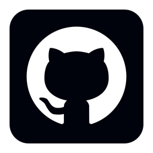

# About this guide and project
================================

This guide was authored and is maintained by:

**Mika Ayenson**    - Threat Research and Detection Engineering (TRADE) lead at Elastic

**Eric Forte**   - Security Research Engineer at Elastic

**Kseniia Ignatovych**   - Security Product Manager at Elastic

This guide is meant to enable the implementation of detections as code in a generic manner, through the application of its use on Elastic detection rules (SIEM). We will continue to maintain and improve this guide, especially in the early stages of the new code and adoption, with intent of this eventually stabilizing.

If you have any feedback or questions along the way, the best place to reach us is in the public slack channel for [security-rules-dac](https://elasticstack.slack.com/archives/C06TE19EP09).

## Licensing and Use

See the LICENSE file for licensing information. This guide is provided as-is and is not officially supported by Elastic. It is intended to be a community-driven project, and we welcome contributions and feedback.
