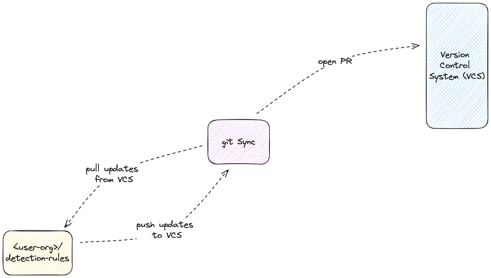

# Core Component: Managing Detection Rules in a VCS
================================

## Overview

Version Control System (VCS) adoption for managing detection rules empowers security teams to implement Detection as Code (DaC) principles through Elastic's Public APIs. With the *VCS as authoritative* or Dual Sync governance models, changes to detection rules are developed, reviewed, and version-controlled within a repository before synced with the production Elastic stack. This method leverages the inherent collaboration, review, auditing, and versioning capabilities of VCS, ensuring a robust governance framework for the lifecycle management of detection rules.  This strategy is the recommended approach to getting started with DaC and managing rules with Elastic’s SIEM.

If the *Elastic security as authoritative* governance model is employed, the VCS component should be largely static, and would serve more as an external store for maintaining versions and diff history, than as a medium for driving changes.

|                                                                         |
| ----------------------------------------------------------------------- |
|  |
| 
*Figure 6: Syncing Local Rules with VCS Through Git Workflows* 
 |

By following the recommended steps within this workflow, you will implement a DaC strategy from scratch that leverages VCS and the detection-rules repo. In particular, you will:

1. Fork the detection-rules repo,
1. Install the Python dependencies,
1. Initialize and configure your DaC custom rules folder using the CLI
1. Configure the unit tests to run
1. Create and version rules using the **detection-rules** capabilities
1. Create and link exception and action lists
1. Locally validate rules

## Considerations

While various strategies exist for managing detection rules within a VCS framework, the [Sub-Component 1: Elastic Detection Rules Repo and Usage](linktbd) approach is showcased throughout this reference. It demonstrates effective rule management techniques utilizing the detection-rules repository alongside available configurations. It is important to highlight that, among the discussed methods, the **detection-rules** repository approach remains the primary and actively supported method for managing security rules within the Elastic ecosystem. It requires some familiarity with the [detection-rules](https://github.com/elastic/detection-rules) repository to take full advantage of the features available. This strategy ensures that security teams can leverage the full potential of Elastic's capabilities in a structured, version-controlled manner.

With that being said, there has been a big initiative to decouple and abstract components where it makes sense, to allow for adoption of principles, with easier customization and extensibility. The intent here is that you can build from within the repo (via a forked version), or you can import the components as needed, whether they are part of the base repo functionality, or one of the embedded modules, such as Kibana and KQL. Finally, there is the option to not directly adopt or employ from the repo at all, but consult it as a reference to build out something more specific (within the constraints of the Elastic v2 License).

Terraform, as a powerful tool for infrastructure as code (IaC), offers significant potential for automating many aspects of DaC processes. By defining infrastructure and configuration details, Terraform can automate the setup and maintenance of environments crucial for DaC workflows, such as provisioning Elastic Security instances, configuring Elastic Security for rule management, or establishing CI/CD pipelines for rule deployment. However, this guide does not delve into Terraform-specific examples to maintain a focus on DaC principles applicable across various tools and platforms. The versatility of Terraform means it can be integrated into many components of DaC, providing a layer of automation that enhances efficiency and consistency across detection rule lifecycle management.

## Sub-Component 1: Elastic Detection Rules Repo and Usage

Reference [Getting Started with the Repo](linktbd) internals to get setup with the detection rules repo and for an understanding of the layout. It is also highly recommended to step through all of the internals in order to fully understand functionality and usage.

|Pros|Cons|
|-|-|
|- Open Source Collaboration: Encourages open-source contributions, allowing for community-driven enhancements and shared improvements.   - Comprehensive Tooling: The CLI support simplifies DaC processes, from syncing to validation, making rule management more efficient.   - Extensive Validation and Testing: Incorporates built-in unit tests and schemas to validate detection rules against Elastic's standards before deployment rigorously.   - Flexibility and Customization: Designed to accommodate diverse operational needs, the repository can be tailored for specific environments or detection strategies.   - Maintained: constantly updated to reflect upstream changes and bugs addressed.|- Learning Curve: Familiarity with the command line and Git is necessary to fully utilize the repository’s capabilities, which might present a hurdle for some users.   - Limited UI Integrations: While the CLI offers powerful functionalities, certain rule configurations that are accessible through Elastic Security's UI might not be directly supported or require manual adjustments.   - Customization Requirements: To align with unique organizational requirements or to incorporate non-standard rule types, additional customization of the repository structure or scripts may be needed.   - Primary purpose: built for the internal Threat Research and Detection Engineering (TRADE) team to maintain pre-built rule set|

### CLI

Reference the [CLI](linktbd) internals usage of CLI for a better understanding of its intent and how to use it.

|Pros|Cons|
|-|-|
|- Integration with Public Elastic APIs: Serves as a convenient reference for Elastic API utilization.  - Simplified Command Execution: Condenses multiple DAC processes into singular commands for efficiency.  - Versatility: Harnesses the full potential of CLI for rule management.|- Custom Application Limitations: May not seamlessly integrate with all custom applications specific to user environments.  - Intentional Coupling: Some commands are intentionally designed to be closely integrated with specific workflows.|

### Unit Tests

Reference the [Unit Tests](linktbd) internals usage of unit tests for a better understanding of the tests that the suite is composed of, and best practices around implementing tests.

|Pros|Cons|
|-|-|
|- Flexibility in Testing: Allows configuration to either execute or skip specific unit tests, catering to diverse testing needs.  - Adherence to Best Practices: Incorporates Elastic's recommended rule development practices, ensuring high-quality rule creation.  - Independent Validation: Facilitates the validation of query syntax and schema conformity outside of the Elastic stack, offering an additional layer of assurance.|-Limited Coverage: Some specialized rule features might not be fully supported, requiring external validation methods.  - Customization Challenges: Adapting tests for unique scenarios or integrating divergent unit tests with upstream changes may pose difficulties.  - Time-Consuming: The comprehensive nature of the tests may lead to longer execution times, particularly when loading extensive rule sets.|

### Custom Unit Tests

WIP

| Pros | Cons |
| - | - |
|||

### Schemas and Data Structures

Reference the [Schemas and Data Structures](linktbd) internals usage of schemas and data structures for a better understanding of their purpose and how to leverage them.

|Pros|Cons|
|-|-|
|- Outside-the-SIEM Validation: Enables rule verification independently from the Elastic stack, ensuring rules are ready for deployment.  - Dataclass Support: Provides a structured format for rule development, accommodating updates as new features are introduced in Elastic Security.|- Feature Limitations: Not all rule functionalities are encapsulated within the dataclasses, potentially necessitating manual verification.  - Adaptation Required: Custom applications or some rule fields (e.g. saved queries) may require additional effort to align with the provided schemas and dataclasses if needed.|

## Sub-Component 2: Incorporating Custom Rules

Reference the [Incorporating Custom Rules](linktbd) internals for a better understanding of how to incorporate custom rules.

## Sub-Component 3: Creating Detection Rules

Reference the [Creating Detection Rules](linktbd) internals for a better understanding of how to create detection rules.

## Sub-Component 4: Rule Versioning

Reference the [Rule Versioning](linktbd) internals for a better understanding of how to version rules.

## Sub-Component 5: Exceptions and Actions

Reference the [Exceptions and Actions](linktbd) internals for a better understanding of how to create exceptions and actions.

## Sub-Component 6: Unit testing

Reference the [Unit Testing](linktbd) internals for a better understanding of how to unit test rules.

## Sub-Component 7: Rule Schema Validation

Reference the [Rule Schema Validation](linktbd) internals for a better understanding of how to validate rule schemas.

## Sub-Component 8: Detection Logic Validation

Reference the [Detection Logic Validation](linktbd) internals for a better understanding of how to validate detection logic.

