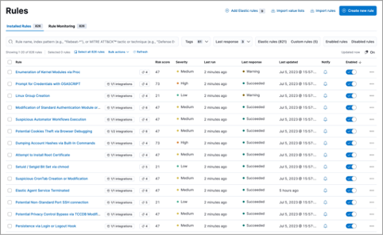

# Core Component: Managing Detection Rules in Elastic Security
================================

## Overview

This section explores the intricacies of managing detection rules within Elastic Security as an integral component of Detection as Code (DaC). It examines different approaches to rule management, focusing on scenarios where the source of truth for rules is maintained within a Version Control System (VCS), directly in Elastic Security, or through a synchronized method that leverages both platforms. It highlights why security analysts might opt for rule management in Elastic Security over VCS, even when the latest rule versions are stored externally.

|                                                                                           |
| ----------------------------------------------------------------------------------------- |
|  |
| 
*Figure 9: Elastic Security Rules Management UI* 
                                       |

## Considerations

Effective [rule management in Elastic Security](https://www.elastic.co/guide/en/security/current/rules-ui-management.html) requires understanding the available security features, workflows, and how they compare to managing rules in VCS. It's important to evaluate the benefits of immediate rule deployment and testing in Elastic Security against the structured version control and collaboration offered by VCS. The ability to quickly deploy and test rules within Elastic Security is balanced against the structured version control, collaboration, and historical tracking provided by VCS systems. This balance is crucial for teams that, while primarily operating within Elastic Security for daily tasks, require robust external processes for rule oversight and version management.

💡 Note: More detail on syncing is provided in [Core Component: Syncing Rules and Data from Elastic Security to VCS](./core_component_syncing_rules_and_data_from_elastic_security_to_vcs.md) and [Core Component: Syncing Rules and Data from VCS to Elastic Security](./core_component_syncing_rules_and_data_from_vcs_to_elastic_security.md).

## Sub-Component 1: Source of Truth

### Option 1: VCS as the Source of Truth

In this option, rules, exception/action lists are managed and edited within Elastic Security, but the latest version or "source of truth" of these rules is stored and versioned in a VCS repository. This approach allows for detailed change tracking, collaboration, and rule versioning outside of Elastic Security.

|Pros|Cons|
|-|-|
|- Version Control: Leverages VCS capabilities for detailed tracking of rule changes and history.  - Collaboration: Facilitates collaborative rule development and peer review processes.|- Syncing Complexity: Requires mechanisms to regularly sync rule changes from Elastic Security to VCS.  - Potential for Drift: Risk of rule versions drifting between Elastic Security and VCS without strict syncing protocols.|

**Steps:**

1. Develop rules directly in Elastic Security for immediate testing and deployment.
1. Use Elastic API calls, CICD workflows, or manual processes to export updated rules from Elastic Security to the VCS repository.
1. Implement regular synchronization checks to ensure the VCS repository accurately reflects the latest rule versions from Elastic Security.

### Option 2: Elastic Security as the Source of Truth

In this approach, rules are created, managed, and stored directly in Elastic Security, with Elastic Security acting as the primary source of truth. This approach emphasizes the use of Elastic Security's UI and built-in features for rule management, relying on Elastic Security's versioning and export capabilities for rule backups and audits.

|Pros|Cons|
|-|-|
|- Immediate Deployment: Enables quick rule testing, tuning, and deployment directly within the security platform.  - Integrated Management: Utilizes Elastic Security's UI for rule creation, modification, and management without the need for external tools.|  - Limited Version Control: Does not offer the same level of detailed version history and rollback capabilities as VCS.  - Collaboration Challenges: May limit collaborative development and peer review processes available in VCS platforms.|

**Steps:**

1. Utilize Elastic Security's Security Solution interface to create and manage detection rules.
1. Since Elastic Security is the source of truth, it may be wise to regularly export rules for backup purposes and store them in a secure location.

### Option 3: Hybrid Rule Management

This hybrid approach ensures rules are managed in Elastic Security with capabilities to sync changes both to and from VCS. It combines the immediate operational advantages of Elastic Security with the structured version control and collaboration benefits of VCS.

|Pros|Cons|
|-|-|
|- Best of Both Worlds: Combines the operational efficiency of Elastic Security with the version control strengths of VCS.  - Flexible Workflow: Supports diverse team workflows, allowing for both immediate rule deployment and detailed change tracking.|- Syncing Overhead: Requires additional tools or processes to maintain rule synchronization between Elastic Security and VCS.  - Complex Configuration: May necessitate complex setup to automate the syncing process effectively.|

**Steps:**

1. Establish rules and workflows for when and how rules are synced between Elastic Security and VCS.
1. Implement automation tools or scripts to facilitate the regular syncing of rule definitions and updates in both directions.
1. Monitor the syncing process closely to identify and resolve any discrepancies or conflicts that arise between the two platforms.
