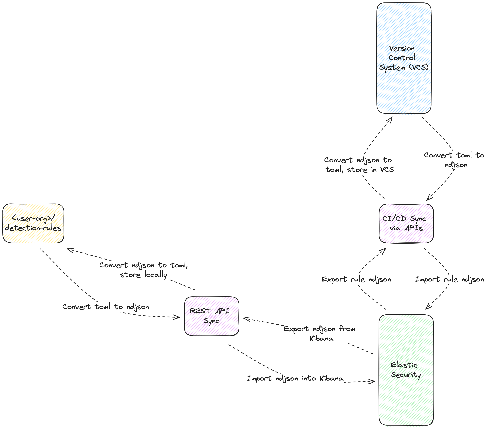

# Core Component: Syncing Rules and Data from Elastic Security to VCS
================================

## Overview

This workflow focuses on the process of transferring detection rules from Elastic Security to a VCS, leveraging external tools and workflows. Currently, direct integrations to automate this process from Elastic Security's end are limited, requiring custom solutions to ensure that detection rules are consistently and accurately backed up in VCS. Some of these approaches overlap with syncing options discussed in [Core Component: Syncing Rules and Data from VCS to Elastic Security](./core_component_syncing_rules_and_data_from_vcs_to_elastic_security.md).

|                                                                                           |
| ----------------------------------------------------------------------------------------- |
|  |
| <center>*Figure 10: Direct REST API Sync: From Local Repo to Elastic Security w/ Optional VCS Preservation* </center>                                       |

Alternatively to using **git** workflows, the available REST API calls can be used directly to manage syncing rules. In this workflow, VCS can still be used, however the rule path traverses from the local repo directly to Elastic Security, and then optionally preserved in VCS.

## Considerations

When planning to sync rules from Elastic Security to VCS, it's important to consider the frequency of updates, the potential for rule tuning/updates, and the need for historical tracking of rule changes.

## Sub-Component 1: Exporting Rules via Direct HTTP Request API Calls

### Option 1:  Detection Rules Engine

Utilizing the Detection Rules API, security teams can export detection rules from Elastic Security for storage in a VCS. This method requires familiarity with Elastic's API and scripting capabilities to automate the export process. This approach is similar to syncing rules from VCS to Elastic Security, only rules are pulled from Elastic Security and stored. Elastic Security provides UI options to export rules, however the API may provide a more automated opportunity to sync rules. Prior to opening a PR for review, the rules should be broken up into separate files to ease the rule review process.

|Pros|Cons|
|-|-|
|- Automation Potential: Can be automated through scripting to regularly update rule sets in VCS.<br/> - Rule Format: Able to store the rule in any format suitable for the team (e.g. JSON, YAML, etc.).|- Complex Setup: Requires initial configuration and understanding of Elastic's API.<br/> - Manual Intervention: Without full automation, manual steps may be necessary to initiate exports.|

**Steps:**

1. Authenticate with the Elastic Security environment using API keys or user credentials.
1. Utilize the Detection Engine API to export the desired detection rules.
1. Format the exported data as needed and commit to the VCS repository.

## Sub-Component 2: Exporting Rules via CI/CD

### Option 1: Manual Dispatch Pull

This approach involves creating a CI/CD workflow, such as a GitHub Action, that manually triggers the export of detection rules from Elastic Security into VCS, potentially opening a pull request (PR) for review. Robust workflows are able to export rules, transform to a rule spec, and also integration with GitHub APIs to facilitate reviews.

|Pros|Cons|
|-|-|
|- Controlled Updates: Provides the ability to trigger exports at desired times, offering control over when updates are made.<br> - Review Process: Can automatically generate PRs for team review before merging rule changes.|- Manual Triggers: Requires an action to initiate the export, adding a step to the workflow.<br> - Integration Complexity: Setup of CI/CD workflows can be intricate, depending on the complexity of the rule sets.|

**Steps:**

1. Configure a GitHub Action or other CI/CD workflow with a manual dispatch trigger for rule exports.

```yaml
name: Manually Sync Rules from Elastic Security to GitHub

on:
  workflow_dispatch:
    inputs:
      pr_sync_rules_from_elastic:
        description: 'Sync rules from Elastic Security (direct commit (false) vs PR (true))'
        required: true
        default: 'true'
      space:
        description: 'Specify the Kibana space to export rules from'
        required: false
        default: 'dev'

jobs:
  manual-dispatch-sync:
    runs-on: ubuntu-latest
    env:
      CUSTOM_RULES_DIR: ${{ secrets.CUSTOM_RULES_DIR }}

    steps:
    - name: Checkout Repository
      uses: actions/checkout@v2

    - name: Set up Python 3.12
      uses: actions/setup-python@v2
      with:
        python-version: '3.12'

    - name: Install Dependencies
      run: |
        python -m pip install --upgrade pip
        pip cache purge
        pip install .[dev]

    - name: Export Rules from Elastic Security and Import Rules to TOML
      run: |
        python -m detection_rules kibana --space "${{ github.event.inputs.space }}" export-rules --directory ${{ env.CUSTOM_RULES_DIR }}/rules/
      env:
        DR_CLOUD_ID: ${{ secrets.ELASTIC_CLOUD_ID }}
        DR_KIBANA_USER: ${{ secrets.ELASTIC_USERNAME }}
        DR_KIBANA_PASSWORD: ${{ secrets.ELASTIC_PASSWORD }}

    - name: Update Version Lock
      run: |
        python -m detection_rules dev update-lock-versions --force

    - name: Create Pull Request
      if: ${{ github.event.inputs.pr_sync_rules_from_elastic == 'true' }}
      uses: peter-evans/create-pull-request@v6
      with:
        token: ${{ secrets.WRITE_GITHUB_TOKEN }}
        commit-message: "Sync rules from Elastic Security"
        title: "Sync rules from Elastic Security"
        body: "This PR syncs rules from Elastic Security to the repository for review."
        branch: "sync-rules-${{ github.run_id }}"
        delete-branch: true
        labels: "auto-update"

    - name: Commit Directly to Main
      if: ${{ github.event.inputs.pr_sync_rules_from_elastic == 'false' }}
      uses: stefanzweifel/git-auto-commit-action@v5
      with:
        commit_message: "Manual dispatch sync"
        branch: main
        file_pattern: "."
        commit_user_name: "GitHub Action"
        commit_user_email: "action@github.com"
      env:
        GITHUB_TOKEN: ${{ secrets.WRITE_GITHUB_TOKEN }}
```
2. Set the environment variables to the Elastic Security environment as [GitHub secrets](https://docs.github.com/en/actions/security-guides/using-secrets-in-github-actions) so your pipeline can deploy to the proper environment.


3. Script the API calls to Elastic Security for rule extraction.

```bash
# Export Rules from Elastic Security
python -m detection_rules kibana export-rules -d test-export-rules --skip-errors

█▀▀▄ ▄▄▄ ▄▄▄ ▄▄▄ ▄▄▄ ▄▄▄ ▄▄▄ ▄▄▄ ▄   ▄      █▀▀▄ ▄  ▄ ▄   ▄▄▄ ▄▄▄
█  █ █▄▄  █  █▄▄ █    █   █  █ █ █▀▄ █      █▄▄▀ █  █ █   █▄▄ █▄▄
█▄▄▀ █▄▄  █  █▄▄ █▄▄  █  ▄█▄ █▄█ █ ▀▄█      █ ▀▄ █▄▄█ █▄▄ █▄▄ ▄▄█

DEBUG MODE ENABLED
- skipping Stolen Credentials Used to Login to Okta Account After MFA Reset - ValidationError
- skipping First Occurrence of Okta User Session Started via Proxy - ValidationError
- skipping ESQL test: cmd child of Explorer - ValidationError
- skipping Potential Persistence Through Run Control Detected - ValidationError
- skipping First Time Seen AWS Secret Value Accessed in Secrets Manager - ValidationError
- skipping Potential Shadow File Read via Command Line Utilities - ValidationError
- skipping Abnormal Process ID or Lock File Created - ValidationError
- skipping New service installed in last 24 hours - ValidationError
- skipping Scheduled Task or Driver added - KqlParseError
- skipping Scheduled Task or Driver removed - KqlParseError
- skipping name - ValidationError
33 rules exported
22 rules converted
22 saved to test-export-rules
11 errors saved to test-export-rules/_errors.txt
```

4. Format and commit the extracted rules into VCS, optionally creating a PR for review.

```bash
# Import Rules into Detection Rules
python -m detection_rules import-rules-to-repo ...
```

### Option 2: Cron Scheduling Pull

Setting up a CI/CD workflow that periodically triggers, such as through a cron job, automates the process of pulling updates from Elastic Security into VCS and opening PRs for review.

|Pros|Cons|
|-|-|
|- Regular Updates: Ensures that rule updates are regularly pulled into VCS without manual intervention.<br/> - Automated Process: Streamlines the update process, making rule management more efficient.|- Setup Complexity: Requires initial setup of cron jobs and scripting for automation.<br/> - Potential for Overlooked Changes: Automated processes may pull in changes that have not been thoroughly reviewed in Elastic Security.|

**Steps:**

1. Establish a cron job within your CI/CD platform to periodically trigger rule exports.
1. Automate the extraction and formatting of rules from Elastic Security using the Detection Engine API.
1. Commit the updated rules to VCS and optionally open PRs for team review.
