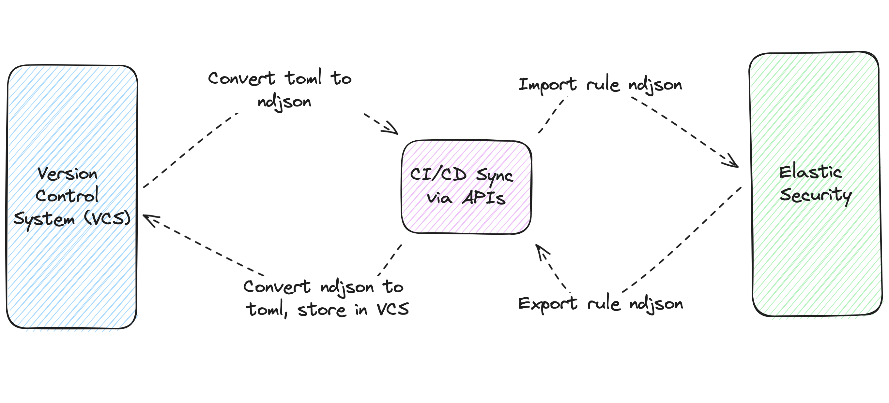
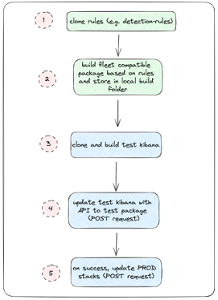
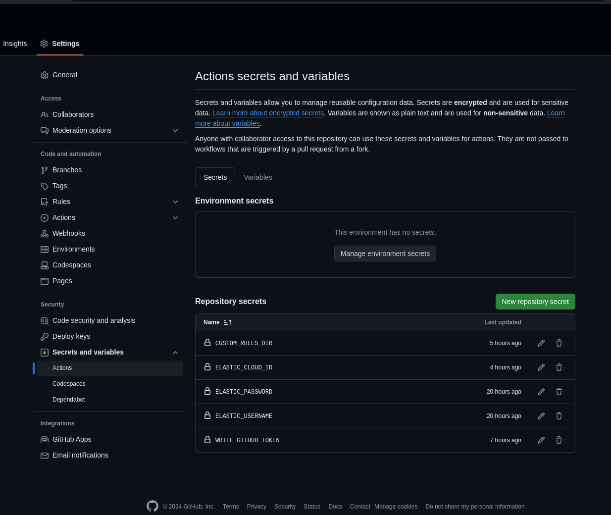

# Core Component: Syncing Rules and Data from VCS to Elastic Security
================================

## Overview

In [Core Component: Managing Detection Rules in a VCS](./core_component_managing_detection_rules_in_a_vcs.md), we highlight managing detection rules through Version Control Systems (VCS) — encompassing validation, unit testing, and managing exceptions among other practices. This workflow progresses to detail the synchronization of detection rules into Elastic Security. *Syncing* in this context signifies the bidirectional movement of rules — either importing/exporting or pushing/pulling — between VCS and Elastic Security. This section is framed from the perspective of **pushing rules from VCS into Elastic Security**, although the processes involved can facilitate movement in either direction.

|                                                                                                                   |
| ----------------------------------------------------------------------------------------------------------------- |
|  |
| <center>*Figure 7: Syncing with Elastic Security Through CI/CD API Workflows* </center>                                                               |

## Considerations

The workflows described here integrate concepts familiar to those versed in Continuous Integration/Continuous Deployment (CI/CD) practices. While examples may leverage [GitHub Actions](https://github.com/features/actions) to illustrate these processes, the methods outlined are intended as guides and should be customized to suit specific operational requirements. It's important to note that independent of the CI/CD strategy employed, interaction with Elastic's APIs remains a fundamental aspect of the rule synchronization process. In general, here are the end to end steps:

1. Rule Preparation and Validation: Begin by ensuring all rules within the VCS repository have passed validation and unit tests. This step is crucial to avoid syncing rules that could potentially cause issues within Elastic Security.
1. CI/CD Configuration: Configure your CI/CD pipeline (e.g., GitHub Actions) to automate the rule syncing process. This setup should include steps for rule validation, packaging, and deployment triggers based on specified conditions (e.g., merges into a main branch).
1. API Integration for Rule Syncing: Utilize Elastic Security's Detection Engine API to push rules from VCS to Elastic Security. This involves crafting API requests to create or update rules in Elastic Security based on the rule definitions stored in VCS. Ensure API keys or authentication credentials are securely managed within the CI/CD pipeline to facilitate secure API interactions.
1. Exception and Action List Management: If your rules utilize exception lists or response actions, ensure these dependencies are also managed and synced appropriately. This may involve additional API calls to manage these entities in Elastic Security.
1. Monitoring and Feedback: Implement monitoring within the CI/CD pipeline to capture the status of rule deployments. This could include notifications on success or failure, enabling quick response to deployment issues. Consider feedback loops where deployment outcomes can inform rule development practices, potentially triggering additional tests or validations before future deployments.
1. Documentation and Change Management: Maintain documentation of the CI/CD process, including any custom scripts or configurations used for rule syncing. This ensures transparency and facilitates onboarding for new team members. Implement change management practices to track modifications to the rule set, including version control of rule definitions and a log of deployments to Elastic Security.

💡 Note: Please remember to backup your rules if you are planning to overwrite them authoritatively from a VCS while you are setting up your DaC pipeline! Once rules are overwritten in Elastic Security/Kibana it may be impossible to recover them! See the [FAQ](./faq.md#q8-how-can-i-backup-my-rules-prior-to-overwriting-rules-in-kibana) for more info on backing up rules. 

## Sub-Component 1: Deploying via Direct HTTP Request API Calls

### Option 1:  Elastic Security APIs

The [Elastic Security APIs](https://www.elastic.co/guide/en/security/current/security-apis.html) offer comprehensive endpoints for managing Create, Read, Update, Delete (CRUD) operations within Elastic Security through REST API calls. These APIs can be utilized directly, bypassing the CLI options provided by the detection-rules repository. The CLI aids in simplifying connection setup, wrapping specific endpoints to integrate core Detection as Code (DAC) components like validation, field transformation, and conversion to JSON.

|Pros|Cons|
|-|-|
|- Comprehensive CRUD Support: Directly supported standard APIs for managing security rules.</br> - CLI Integration: Simplifies rule syncing for CI/CD workflows, providing a bridge for direct API interaction.|- Limited API Coverage: Not all Elastic Security APIs are integrated within the detection-rules repo, which might be necessary for advanced DAC workflows (e.g., timelines, cases)|

**Steps:**

1. **Authenticate** using one of the several Elastic API [authentication](https://www.elastic.co/guide/en/security/current/rule-api-overview.html#_authentication_2) options available or using one of the detection-rules options

CLI commands which are tied to Elastic Security and Elasticsearch are capable of parsing auth-related keyword args from a config file or environment variables. If a value is set in multiple places, such as config file and environment variable, the order of precedence will be as follows:
- explicitly passed args (such as `--user joe`)
- environment variables
- config values
- prompt (this only applies to certain values)

In the root directory of this repo, create the file **.detection-rules-cfg.json** and add relevant values, where kibana credentials provide access to the Elastic Security stack.

```json
{
  "elasticsearch_url": "http://localhost:9200",
  "kibana_url": "http://localhost:5601",
  "cloud_id": "",
  "es_username": "elastic",
  "es_password": "password",
  "kibana_username": "elastic",
  "kibana_password": "password"
}
```

Currently supported arguments:

```config
 elasticsearch_url
 kibana_url
 cloud_id
 *_username (kibana and es)
 *_password (kibana and es)
 api_key
```

If you are authenticating using an API key, you do not need a username and password. E.g. for Kibana

```json
{
  "kibana_url": "http://localhost:5601",
  "api_key": "key value",
}
```

Additionally, you can use environment variables instead of the credentials file by using the `DR_*` format.

E.g.

```
env:
        DR_KIBANA_URL: ${{ secrets.KIBANA_URL }}
        DR_KIBANA_USER: ${{ secrets.KIBANA_USER }}
        DR_KIBANA_PASSWORD: ${{ secrets.KIBANA_PASSWORD }}
```

2. Configure your [custom rules directory](./internals_of_the_detection_rules_repo.md#option-1-using-the-built-in-configuration)
3. Once authenticated, you can use [API calls](https://www.elastic.co/guide/en/security/current/security-apis.html#_api_calls) directly. If using the detection-rules CLI, the following DAC commands are available. Deploy the latest set of rules by running the following command:

```bash
(detection-rules-build) ➜  detection-rules git:(main) ✗ python -m detection_rules -h
Loaded config file: /Users/stryker/workspace/ElasticGitHub/detection-rules/.detection-rules-cfg.json

█▀▀▄ ▄▄▄ ▄▄▄ ▄▄▄ ▄▄▄ ▄▄▄ ▄▄▄ ▄▄▄ ▄   ▄      █▀▀▄ ▄  ▄ ▄   ▄▄▄ ▄▄▄
█  █ █▄▄  █  █▄▄ █    █   █  █ █ █▀▄ █      █▄▄▀ █  █ █   █▄▄ █▄▄
█▄▄▀ █▄▄  █  █▄▄ █▄▄  █  ▄█▄ █▄█ █ ▀▄█      █ ▀▄ █▄▄█ █▄▄ █▄▄ ▄▄█

Usage: detection_rules [OPTIONS] COMMAND [ARGS]...

  Commands for detection-rules repository.

Options:
  -D, --debug / -N, --no-debug  Print full exception stacktrace on errors
  -h, --help                    Show this message and exit.

Commands:
  ...
  export-rules-from-repo  Export rule(s) and exception(s) into an importable ndjson file.
  generate-rules-index    Generate enriched indexes of rules, based on a KQL search, for indexing/importing into elasticsearch/kibana.
  import-rules-to-repo    Import rules from json, toml, or yaml files containing Kibana exported rule(s).
  ...
```

💡 Note: For stacks with a version prior to 9.0, one can use the `kibana upload-rule` command. However, this is not recommended and one should use the `kibana import-rules` in its place.

```bash
█▀▀▄ ▄▄▄ ▄▄▄ ▄▄▄ ▄▄▄ ▄▄▄ ▄▄▄ ▄▄▄ ▄   ▄      █▀▀▄ ▄  ▄ ▄   ▄▄▄ ▄▄▄
█  █ █▄▄  █  █▄▄ █    █   █  █ █ █▀▄ █      █▄▄▀ █  █ █   █▄▄ █▄▄
█▄▄▀ █▄▄  █  █▄▄ █▄▄  █  ▄█▄ █▄█ █ ▀▄█      █ ▀▄ █▄▄█ █▄▄ █▄▄ ▄▄█

Usage: detection_rules kibana [OPTIONS] COMMAND [ARGS]...

  Commands for integrating with Kibana.

Options:
  --ignore-ssl-errors TEXT
  --space TEXT                 Kibana space
  --provider-name TEXT         Elastic Cloud providers: cloud-basic and cloud-saml (for SSO)
  --provider-type TEXT         Elastic Cloud providers: basic and saml (for SSO)
  -ku, --kibana-user TEXT
  --kibana-url TEXT
  -kp, --kibana-password TEXT
  -kc, --kibana-cookie TEXT    Cookie from an authed session
  --api-key TEXT
  --cloud-id TEXT              ID of the cloud instance.
  -h, --help                   Show this message and exit.

Commands:
  export-rules   Export custom rules from Kibana.
  import-rules   Import custom rules into Kibana.
  search-alerts  Search detection engine alerts with KQL.
  upload-rule    [Deprecated] Upload a list of rule .toml files to Kibana.
```

### Testing

```
python -m detection_rules kibana export-rules -d test-export-rules --skip-errors

█▀▀▄ ▄▄▄ ▄▄▄ ▄▄▄ ▄▄▄ ▄▄▄ ▄▄▄ ▄▄▄ ▄   ▄      █▀▀▄ ▄  ▄ ▄   ▄▄▄ ▄▄▄
█  █ █▄▄  █  █▄▄ █    █   █  █ █ █▀▄ █      █▄▄▀ █  █ █   █▄▄ █▄▄
█▄▄▀ █▄▄  █  █▄▄ █▄▄  █  ▄█▄ █▄█ █ ▀▄█      █ ▀▄ █▄▄█ █▄▄ █▄▄ ▄▄█

DEBUG MODE ENABLED
- skipping Stolen Credentials Used to Login to Okta Account After MFA Reset - ValidationError
- skipping First Occurrence of Okta User Session Started via Proxy - ValidationError
- skipping ESQL test: cmd child of Explorer - ValidationError
- skipping Potential Persistence Through Run Control Detected - ValidationError
- skipping First Time Seen AWS Secret Value Accessed in Secrets Manager - ValidationError
- skipping Potential Shadow File Read via Command Line Utilities - ValidationError
- skipping Abnormal Process ID or Lock File Created - ValidationError
- skipping New service installed in last 24 hours - ValidationError
- skipping Scheduled Task or Driver added - KqlParseError
- skipping Scheduled Task or Driver removed - KqlParseError
- skipping name - ValidationError
33 rules exported
22 rules converted
22 saved to test-export-rules
11 errors saved to test-export-rules/_errors.txt
```

```
ls test-export-rules

_errors.txt
collection_exchange_mailbox_export_via_powershell.toml.toml
credential_access_multiple_okta_user_auth_events_with_same_device_token_hash_behind_a_proxy.toml.toml
credential_access_potential_okta_mfa_bombing_via_push_notifications.toml.toml
defense_evasion_agent_spoofing_multiple_hosts_using_same_agent.toml.toml
defense_evasion_attempt_to_disable_syslog_service.toml.toml
defense_evasion_kernel_module_removal.toml.toml
discovery_enumeration_of_kernel_modules.toml.toml
execution_interactive_terminal_spawned_via_python.toml.toml
initial_access_multiple_okta_client_addresses_for_a_single_user_session.toml.toml
initial_access_new_okta_authentication_behavior_detected.toml.toml
initial_access_okta_fastpass_phishing_detection.toml.toml
initial_access_okta_sign_in_events_via_third_party_idp.toml.toml
initial_access_okta_user_sessions_started_from_different_geolocations.toml.toml
lateral_movement_multiple_okta_sessions_detected_for_a_single_user.toml.toml
my_first_alert.toml.toml
persistence_new_okta_identity_provider_idp_added_by_admin.toml.toml
test_data_view.toml.toml
test_noisy.toml.toml
test_suppress.toml.toml
web_application_suspicious_activity_post_request_declined.toml.toml
web_application_suspicious_activity_sqlmap_user_agent.toml.toml
web_application_suspicious_activity_unauthorized_method.toml.toml
```

```
cat test-export-rules/_errors.txt
- Stolen Credentials Used to Login to Okta Account After MFA Reset - {'_schema': ['Setup header found in both note and setup fields.']}
- First Occurrence of Okta User Session Started via Proxy - {'rule': [ValidationError({'type': ['Must be equal to eql.'], 'language': ['Must be equal to eql.']}), ValidationError({'type': ['Must be equal to esql.'], 'language': ['Must be equal to esql.']}), ValidationError({'type': ['Must be equal to threshold.'], 'threshold': ['Missing data for required field.']}), ValidationError({'type': ['Must be equal to threat_match.'], 'threat_mapping': ['Missing data for required field.'], 'threat_index': ['Missing data for required field.']}), ValidationError({'type': ['Must be equal to machine_learning.'], 'anomaly_threshold': ['Missing data for required field.'], 'machine_learning_job_id': ['Missing data for required field.']}), ValidationError({'type': ['Must be equal to query.']}), ValidationError({'new_terms': ['Missing data for required field.']})]}
- ESQL test: cmd child of Explorer - {'rule': [ValidationError({'type': ['Must be equal to eql.'], 'threat': {0: {'tactic': {'reference': ['String does not match expected pattern.']}, 'technique': {0: {'reference': ['String does not match expected pattern.']}}}}, 'language': ['Must be equal to eql.']}), ValidationError({'threat': {0: {'tactic': {'reference': ['String does not match expected pattern.']}, 'technique': {0: {'reference': ['String does not match expected pattern.']}}}}}), ValidationError({'type': ['Must be equal to threshold.'], 'threat': {0: {'tactic': {'reference': ['String does not match expected pattern.']}, 'technique': {0: {'reference': ['String does not match expected pattern.']}}}}, 'threshold': ['Missing data for required field.']}), ValidationError({'type': ['Must be equal to threat_match.'], 'threat': {0: {'tactic': {'reference': ['String does not match expected pattern.']}, 'technique': {0: {'reference': ['String does not match expected pattern.']}}}}, 'threat_mapping': ['Missing data for required field.'], 'threat_index': ['Missing data for required field.']}), ValidationError({'type': ['Must be equal to machine_learning.'], 'threat': {0: {'tactic': {'reference': ['String does not match expected pattern.']}, 'technique': {0: {'reference': ['String does not match expected pattern.']}}}}, 'anomaly_threshold': ['Missing data for required field.'], 'machine_learning_job_id': ['Missing data for required field.']}), ValidationError({'type': ['Must be equal to query.'], 'threat': {0: {'tactic': {'reference': ['String does not match expected pattern.']}, 'technique': {0: {'reference': ['String does not match expected pattern.']}}}}}), ValidationError({'type': ['Must be equal to new_terms.'], 'threat': {0: {'tactic': {'reference': ['String does not match expected pattern.']}, 'technique': {0: {'reference': ['String does not match expected pattern.']}}}}, 'new_terms': ['Missing data for required field.']})]}
- Potential Persistence Through Run Control Detected - {'rule': [ValidationError({'type': ['Must be equal to eql.'], 'language': ['Must be equal to eql.']}), ValidationError({'type': ['Must be equal to esql.'], 'language': ['Must be equal to esql.']}), ValidationError({'type': ['Must be equal to threshold.'], 'threshold': ['Missing data for required field.']}), ValidationError({'type': ['Must be equal to threat_match.'], 'threat_mapping': ['Missing data for required field.'], 'threat_index': ['Missing data for required field.']}), ValidationError({'type': ['Must be equal to machine_learning.'], 'anomaly_threshold': ['Missing data for required field.'], 'machine_learning_job_id': ['Missing data for required field.']}), ValidationError({'type': ['Must be equal to query.']}), ValidationError({'new_terms': ['Missing data for required field.']})]}
- First Time Seen AWS Secret Value Accessed in Secrets Manager - {'rule': [ValidationError({'type': ['Must be equal to eql.'], 'language': ['Must be equal to eql.']}), ValidationError({'type': ['Must be equal to esql.'], 'language': ['Must be equal to esql.']}), ValidationError({'type': ['Must be equal to threshold.'], 'threshold': ['Missing data for required field.']}), ValidationError({'type': ['Must be equal to threat_match.'], 'threat_mapping': ['Missing data for required field.'], 'threat_index': ['Missing data for required field.']}), ValidationError({'type': ['Must be equal to machine_learning.'], 'anomaly_threshold': ['Missing data for required field.'], 'machine_learning_job_id': ['Missing data for required field.']}), ValidationError({'type': ['Must be equal to query.']}), ValidationError({'new_terms': ['Missing data for required field.']})]}
- Potential Shadow File Read via Command Line Utilities - {'rule': [ValidationError({'type': ['Must be equal to eql.'], 'language': ['Must be equal to eql.']}), ValidationError({'type': ['Must be equal to esql.'], 'language': ['Must be equal to esql.']}), ValidationError({'type': ['Must be equal to threshold.'], 'threshold': ['Missing data for required field.']}), ValidationError({'type': ['Must be equal to threat_match.'], 'threat_mapping': ['Missing data for required field.'], 'threat_index': ['Missing data for required field.']}), ValidationError({'type': ['Must be equal to machine_learning.'], 'anomaly_threshold': ['Missing data for required field.'], 'machine_learning_job_id': ['Missing data for required field.']}), ValidationError({'type': ['Must be equal to query.']}), ValidationError({'new_terms': ['Missing data for required field.']})]}
- Abnormal Process ID or Lock File Created - {'rule': [ValidationError({'type': ['Must be equal to eql.'], 'language': ['Must be equal to eql.']}), ValidationError({'type': ['Must be equal to esql.'], 'language': ['Must be equal to esql.']}), ValidationError({'type': ['Must be equal to threshold.'], 'threshold': ['Missing data for required field.']}), ValidationError({'type': ['Must be equal to threat_match.'], 'threat_mapping': ['Missing data for required field.'], 'threat_index': ['Missing data for required field.']}), ValidationError({'type': ['Must be equal to machine_learning.'], 'anomaly_threshold': ['Missing data for required field.'], 'machine_learning_job_id': ['Missing data for required field.']}), ValidationError({'type': ['Must be equal to query.']}), ValidationError({'new_terms': ['Missing data for required field.']})]}
- New service installed in last 24 hours - {'rule': [ValidationError({'type': ['Must be equal to eql.'], 'language': ['Must be equal to eql.']}), ValidationError({'type': ['Must be equal to esql.'], 'language': ['Must be equal to esql.']}), ValidationError({'type': ['Must be equal to threshold.'], 'threshold': ['Missing data for required field.']}), ValidationError({'type': ['Must be equal to threat_match.'], 'threat_mapping': ['Missing data for required field.'], 'threat_index': ['Missing data for required field.']}), ValidationError({'type': ['Must be equal to machine_learning.'], 'anomaly_threshold': ['Missing data for required field.'], 'machine_learning_job_id': ['Missing data for required field.']}), ValidationError({'type': ['Must be equal to query.']}), ValidationError({'new_terms': ['Missing data for required field.']})]}
- Scheduled Task or Driver added - Error at line:1,column:75
Unknown field
data_stream.dataset:osquery_manager.result and osquery_meta.counter>0 and osquery_meta.type:diff and osquery.last_run_code:0 and osquery_meta.action:added
                                                                          ^^^^^^^^^^^^^^^^^
stack: 8.9.0, beats: 8.9.0, ecs: 8.9.0
- Scheduled Task or Driver removed - Error at line:1,column:75
Unknown field
data_stream.dataset:osquery_manager.result and osquery_meta.counter>0 and osquery_meta.type:diff and osquery.last_run_code:0 and osquery_meta.action:removed
                                                                          ^^^^^^^^^^^^^^^^^
stack: 8.9.0, beats: 8.9.0, ecs: 8.9.0
- name - {'rule': [ValidationError({'type': ['Must be equal to eql.'], 'language': ['Must be equal to eql.']}), ValidationError({'type': ['Must be equal to esql.'], 'language': ['Must be equal to esql.']}), ValidationError({'type': ['Must be equal to threshold.'], 'threshold': ['Missing data for required field.']}), ValidationError({'type': ['Must be equal to threat_match.'], 'threat_mapping': ['Missing data for required field.'], 'threat_index': ['Missing data for required field.']}), ValidationError({'type': ['Must be equal to machine_learning.'], 'anomaly_threshold': ['Missing data for required field.'], 'machine_learning_job_id': ['Missing data for required field.']}), ValidationError({'type': ['Must be equal to query.']}), ValidationError({'new_terms': ['Missing data for required field.']})]}(venv312) ➜  detection-rules-fork git:(main) ✗
```

<details>
<summary>Detailed commands output</summary>

Help output:
```
(venv312) ➜  detection-rules-fork git:(main) ✗ python -m detection_rules kibana import-rules -h

█▀▀▄ ▄▄▄ ▄▄▄ ▄▄▄ ▄▄▄ ▄▄▄ ▄▄▄ ▄▄▄ ▄   ▄      █▀▀▄ ▄  ▄ ▄   ▄▄▄ ▄▄▄
█  █ █▄▄  █  █▄▄ █    █   █  █ █ █▀▄ █      █▄▄▀ █  █ █   █▄▄ █▄▄
█▄▄▀ █▄▄  █  █▄▄ █▄▄  █  ▄█▄ █▄█ █ ▀▄█      █ ▀▄ █▄▄█ █▄▄ █▄▄ ▄▄█

DEBUG MODE ENABLED
Kibana client:
Options:
  --ignore-ssl-errors TEXT
  --space TEXT                 Kibana space
  --provider-name TEXT         Elastic Cloud providers: cloud-basic and cloud-
                               saml (for SSO)
  --provider-type TEXT         Elastic Cloud providers: basic and saml (for
                               SSO)
  -ku, --kibana-user TEXT
  --kibana-url TEXT
  -kp, --kibana-password TEXT
  -kc, --kibana-cookie TEXT    Cookie from an authed session
  --cloud-id TEXT              ID of the cloud instance.

Usage: detection_rules kibana import-rules [OPTIONS]

  Import custom rules into Kibana.

Options:
  -f, --rule-file FILE
  -d, --directory DIRECTORY       Recursively load rules from a directory
  -id, --rule-id TEXT
  -o, --overwrite                 Overwrite existing rules
  -e, --overwrite-exceptions      Overwrite exceptions in existing rules
  -a, --overwrite-action-connectors
                                  Overwrite action connectors in existing
                                  rules
  -h, --help                      Show this message and exit.
```

Existing rule fails as expected:
```
(venv312) ➜  detection-rules-fork git:(main) ✗ python -m detection_rules kibana import-rules -f test-export-rules/credential_access_EXISTING_RULE.toml

█▀▀▄ ▄▄▄ ▄▄▄ ▄▄▄ ▄▄▄ ▄▄▄ ▄▄▄ ▄▄▄ ▄   ▄      █▀▀▄ ▄  ▄ ▄   ▄▄▄ ▄▄▄
█  █ █▄▄  █  █▄▄ █    █   █  █ █ █▀▄ █      █▄▄▀ █  █ █   █▄▄ █▄▄
█▄▄▀ █▄▄  █  █▄▄ █▄▄  █  ▄█▄ █▄█ █ ▀▄█      █ ▀▄ █▄▄█ █▄▄ █▄▄ ▄▄█

DEBUG MODE ENABLED
1 rule(s) failed to import!
 - 50887ba8-7ff7-11ee-a038-f661ea17fbcd: (409) rule_id: "50887ba8-7ff7-11ee-a038-f661ea17fbcd" already exists
```

`-o` overwrite forces the import successfully
```
(venv312) ➜  detection-rules-fork git:(main) ✗ python -m detection_rules kibana import-rules -f test-export-rules/credential_access_EXISTING_RULE.toml -o

█▀▀▄ ▄▄▄ ▄▄▄ ▄▄▄ ▄▄▄ ▄▄▄ ▄▄▄ ▄▄▄ ▄   ▄      █▀▀▄ ▄  ▄ ▄   ▄▄▄ ▄▄▄
█  █ █▄▄  █  █▄▄ █    █   █  █ █ █▀▄ █      █▄▄▀ █  █ █   █▄▄ █▄▄
█▄▄▀ █▄▄  █  █▄▄ █▄▄  █  ▄█▄ █▄█ █ ▀▄█      █ ▀▄ █▄▄█ █▄▄ █▄▄ ▄▄█

DEBUG MODE ENABLED
1 rule(s) successfully imported
 - 50887ba8-7ff7-11ee-a038-f661ea17fbcd
```

New rule successfully imports:
```
(venv312) ➜  detection-rules-fork git:(main) ✗ python -m detection_rules kibana import-rules -f test-export-rules/credential_access_NEW_RULE.toml

█▀▀▄ ▄▄▄ ▄▄▄ ▄▄▄ ▄▄▄ ▄▄▄ ▄▄▄ ▄▄▄ ▄   ▄      █▀▀▄ ▄  ▄ ▄   ▄▄▄ ▄▄▄
█  █ █▄▄  █  █▄▄ █    █   █  █ █ █▀▄ █      █▄▄▀ █  █ █   █▄▄ █▄▄
█▄▄▀ █▄▄  █  █▄▄ █▄▄  █  ▄█▄ █▄█ █ ▀▄█      █ ▀▄ █▄▄█ █▄▄ █▄▄ ▄▄█

DEBUG MODE ENABLED
1 rule(s) successfully imported
 - 50887ba8-aaaa-bbbb-a038-f661ea17fbcd
```

The rule loader detects a collision in name and fails as intended:
```
(venv312) ➜  detection-rules-fork git:(main) ✗ python -m detection_rules kibana import-rules -d test-export-rules

█▀▀▄ ▄▄▄ ▄▄▄ ▄▄▄ ▄▄▄ ▄▄▄ ▄▄▄ ▄▄▄ ▄   ▄      █▀▀▄ ▄  ▄ ▄   ▄▄▄ ▄▄▄
█  █ █▄▄  █  █▄▄ █    █   █  █ █ █▀▄ █      █▄▄▀ █  █ █   █▄▄ █▄▄
█▄▄▀ █▄▄  █  █▄▄ █▄▄  █  ▄█▄ █▄█ █ ▀▄█      █ ▀▄ █▄▄█ █▄▄ █▄▄ ▄▄█

DEBUG MODE ENABLED
Error loading rule in ... /detection-rules-fork/test-export-rules/credential_access_NEW_RULE.toml
Traceback (most recent call last):
  File "<frozen runpy>", line 198, in _run_module_as_main
  File "<frozen runpy>", line 88, in _run_code

  ... truncated ...

    assert rule.name not in name_map, \
AssertionError: Rule Name Multiple Okta User Auth Events with Same Device Token Hash Behind a Proxy for 50887ba8-aaaa-bbbb-a038-f661ea17fbcd collides with rule ID 50887ba8-7ff7-11ee-a038-f661ea17fbcd
```

Expected failure on rule_id collision:
```
(venv312) ➜  detection-rules-fork git:(main) ✗ python -m detection_rules kibana import-rules -d test-export-rules
Loaded config file: .../detection-rules-fork/.detection-rules-cfg.yaml

█▀▀▄ ▄▄▄ ▄▄▄ ▄▄▄ ▄▄▄ ▄▄▄ ▄▄▄ ▄▄▄ ▄   ▄      █▀▀▄ ▄  ▄ ▄   ▄▄▄ ▄▄▄
█  █ █▄▄  █  █▄▄ █    █   █  █ █ █▀▄ █      █▄▄▀ █  █ █   █▄▄ █▄▄
█▄▄▀ █▄▄  █  █▄▄ █▄▄  █  ▄█▄ █▄█ █ ▀▄█      █ ▀▄ █▄▄█ █▄▄ █▄▄ ▄▄█

DEBUG MODE ENABLED
Error loading rule in .../detection-rules-fork/test-export-rules/credential_access_multiple_okta_user_auth_events_with_same_device_token_hash_behind_a_proxy.toml
Traceback (most recent call last):
  File "<frozen runpy>", line 198, in _run_module_as_main
  File "<frozen runpy>", line 88, in _run_code

  ... truncated ...

    assert rule.id not in id_map, \
AssertionError: Rule ID 50887ba8-7ff7-11ee-a038-f661ea17fbcd for Multiple Okta User Auth Events with Same Device Token Hash Behind a Proxy collides with rule Multiple Okta User Auth Events with Same Device Token Hash Behind a Proxy
```

Import a full directory - all fail as expected:
```
(venv312) ➜  detection-rules-fork git:(main) ✗ python -m detection_rules kibana import-rules -d test-export-rules

█▀▀▄ ▄▄▄ ▄▄▄ ▄▄▄ ▄▄▄ ▄▄▄ ▄▄▄ ▄▄▄ ▄   ▄      █▀▀▄ ▄  ▄ ▄   ▄▄▄ ▄▄▄
█  █ █▄▄  █  █▄▄ █    █   █  █ █ █▀▄ █      █▄▄▀ █  █ █   █▄▄ █▄▄
█▄▄▀ █▄▄  █  █▄▄ █▄▄  █  ▄█▄ █▄█ █ ▀▄█      █ ▀▄ █▄▄█ █▄▄ █▄▄ ▄▄█

DEBUG MODE ENABLED
23 rule(s) failed to import!
 - ee663abc-fb77-49d2-a7c5-204b9cf888ca: (409) rule_id: "ee663abc-fb77-49d2-a7c5-204b9cf888ca" already exists
 - 50887ba8-aaaa-bbbb-a038-f661ea17fbcd: (409) rule_id: "50887ba8-aaaa-bbbb-a038-f661ea17fbcd" already exists
 - 50887ba8-7ff7-11ee-a038-f661ea17fbcd: (409) rule_id: "50887ba8-7ff7-11ee-a038-f661ea17fbcd" already exists
 - 8a0fbd26-867f-11ee-947c-f661ea17fbcd: (409) rule_id: "8a0fbd26-867f-11ee-947c-f661ea17fbcd" already exists
 - aaaaaaaa-f861-414c-8602-150d5505b777: (409) rule_id: "aaaaaaaa-f861-414c-8602-150d5505b777" already exists
 - 2f8a1226-5720-437d-9c20-e0029deb6194: (409) rule_id: "2f8a1226-5720-437d-9c20-e0029deb6194" already exists
 - cd66a5af-e34b-4bb0-8931-57d0a043f2ef: (409) rule_id: "cd66a5af-e34b-4bb0-8931-57d0a043f2ef" already exists
 - 2d8043ed-5bda-4caf-801c-c1feb7410504: (409) rule_id: "2d8043ed-5bda-4caf-801c-c1feb7410504" already exists
 - d76b02ef-fc95-4001-9297-01cb7412232f: (409) rule_id: "d76b02ef-fc95-4001-9297-01cb7412232f" already exists
 - cc382a2e-7e52-11ee-9aac-f661ea17fbcd: (409) rule_id: "cc382a2e-7e52-11ee-9aac-f661ea17fbcd" already exists
 - 260486ee-7d98-11ee-9599-f661ea17fbcd: (409) rule_id: "260486ee-7d98-11ee-9599-f661ea17fbcd" already exists
 - ee39a9f7-5a79-4b0a-9815-d36b3cf28d3e: (409) rule_id: "ee39a9f7-5a79-4b0a-9815-d36b3cf28d3e" already exists
 - 1ceb05c4-7d25-11ee-9562-f661ea17fbcd: (409) rule_id: "1ceb05c4-7d25-11ee-9562-f661ea17fbcd" already exists
 - 2e56e1bc-867a-11ee-b13e-f661ea17fbcd: (409) rule_id: "2e56e1bc-867a-11ee-b13e-f661ea17fbcd" already exists
 - 621e92b6-7e54-11ee-bdc0-f661ea17fbcd: (409) rule_id: "621e92b6-7e54-11ee-bdc0-f661ea17fbcd" already exists
 - a198fbbd-9413-45ec-a269-47ae4ccf59ce: (409) rule_id: "a198fbbd-9413-45ec-a269-47ae4ccf59ce" already exists
 - 29b53942-7cd4-11ee-b70e-f661ea17fbcd: (409) rule_id: "29b53942-7cd4-11ee-b70e-f661ea17fbcd" already exists
 - aaec44bc-d691-4874-99b2-48ab7392dfd5: (409) rule_id: "aaec44bc-d691-4874-99b2-48ab7392dfd5" already exists
 - 40e1f208-0f70-47d4-98ea-378ccf504ad3: (409) rule_id: "40e1f208-0f70-47d4-98ea-378ccf504ad3" already exists
 - 5e9bc07c-7e7a-415b-a6c0-1cae4a0d256e: (409) rule_id: "5e9bc07c-7e7a-415b-a6c0-1cae4a0d256e" already exists
 - 17d99572-793d-41ae-8b55-cee30db13fa2: (409) rule_id: "17d99572-793d-41ae-8b55-cee30db13fa2" already exists
 - 38accba8-894a-4f32-98d5-7cb01c82f5d6: (409) rule_id: "38accba8-894a-4f32-98d5-7cb01c82f5d6" already exists
 - e1b7d2a6-d23a-4747-b621-d249d83162ea: (409) rule_id: "e1b7d2a6-d23a-4747-b621-d249d83162ea" already exists
```

Import a fulle directory, with `-o` forcing the updates successfully
```
(venv312) ➜  detection-rules-fork git:(main) ✗ python -m detection_rules kibana import-rules -d test-export-rules -o
Loaded config file: .../detection-rules-fork/.detection-rules-cfg.yaml

█▀▀▄ ▄▄▄ ▄▄▄ ▄▄▄ ▄▄▄ ▄▄▄ ▄▄▄ ▄▄▄ ▄   ▄      █▀▀▄ ▄  ▄ ▄   ▄▄▄ ▄▄▄
█  █ █▄▄  █  █▄▄ █    █   █  █ █ █▀▄ █      █▄▄▀ █  █ █   █▄▄ █▄▄
█▄▄▀ █▄▄  █  █▄▄ █▄▄  █  ▄█▄ █▄█ █ ▀▄█      █ ▀▄ █▄▄█ █▄▄ █▄▄ ▄▄█

DEBUG MODE ENABLED
23 rule(s) successfully imported
 - ee663abc-fb77-49d2-a7c5-204b9cf888ca
 - 50887ba8-aaaa-bbbb-a038-f661ea17fbcd
 - 50887ba8-7ff7-11ee-a038-f661ea17fbcd
 - 8a0fbd26-867f-11ee-947c-f661ea17fbcd
 - aaaaaaaa-f861-414c-8602-150d5505b777
 - 2f8a1226-5720-437d-9c20-e0029deb6194
 - cd66a5af-e34b-4bb0-8931-57d0a043f2ef
 - 2d8043ed-5bda-4caf-801c-c1feb7410504
 - d76b02ef-fc95-4001-9297-01cb7412232f
 - cc382a2e-7e52-11ee-9aac-f661ea17fbcd
 - 260486ee-7d98-11ee-9599-f661ea17fbcd
 - ee39a9f7-5a79-4b0a-9815-d36b3cf28d3e
 - 1ceb05c4-7d25-11ee-9562-f661ea17fbcd
 - 2e56e1bc-867a-11ee-b13e-f661ea17fbcd
 - 621e92b6-7e54-11ee-bdc0-f661ea17fbcd
 - a198fbbd-9413-45ec-a269-47ae4ccf59ce
 - 29b53942-7cd4-11ee-b70e-f661ea17fbcd
 - aaec44bc-d691-4874-99b2-48ab7392dfd5
 - 40e1f208-0f70-47d4-98ea-378ccf504ad3
 - 5e9bc07c-7e7a-415b-a6c0-1cae4a0d256e
 - 17d99572-793d-41ae-8b55-cee30db13fa2
 - 38accba8-894a-4f32-98d5-7cb01c82f5d6
 - e1b7d2a6-d23a-4747-b621-d249d83162ea

```

</details>


<details>
<summary>Detailed API calls</summary>

```python
    from kibana import definitions

    rids = ['40e1f208-0f70-47d4-98ea-378ccf504ad3', '5e9bc07c-7e7a-415b-a6c0-1cae4a0d256e']

    # with TypedDict, either is valid, both with static type checking
    st = definitions.RuleBulkSetTags(type='set_tags', value=['tag1', 'tag2'])
    dt: definitions.RuleBulkDeleteTags = {'type': 'delete_tags', 'value': ['tag1', 'tag2']}
    with kibana:
        r1 = RuleResource.bulk_enable(rids, dry_run=True)
        r2 = RuleResource.bulk_disable(rids, dry_run=True)
        r3 = RuleResource.bulk_duplicate(rids, dry_run=True)
        r4 = RuleResource.bulk_export(rids)
        r5 = RuleResource.bulk_edit(edit_object=[st, dt], rule_ids=rids, dry_run=True)
        r6 = RuleResource.bulk_delete(rids, dry_run=True)
```

</details>

4. Finally sync / deploy exception/action lists along with the rules.

💡 Note: The exceptions/actions lists have links to rules by ID in their dedicated schemas. When pushing rule updates, any available action or exception lists will be updated automatically.

```bash
# Import rules (ndjon) to Kibana
python -m detection_rules kibana import-rules ...
```

### Option 2:  Fleet Engine

[Fleet](https://www.elastic.co/guide/en/fleet/current/fleet-overview.html) offers an alternative method primarily used within Elastic to deploy prebuilt rules. This involves building a Fleet-compatible package containing the rules and pushing it using one of the Fleet developer APIs (http://my-kibana:5601/api/fleet/epm/packages). An end-to-end approach might consider building a package, testing the ruleset against an Elastic test stack, and parsing the HTTP response for errors. This approach, while consistent with Elastic's prebuilt rules workflow, is not directly recommended for external workflows as it may bypass critical rule versioning processes in Elastic Security.

|Pros|Cons|
|-|-|
|- Consistent Packaging: Bundles rule packages efficiently, updating Kibana [saved objects](https://www.elastic.co/guide/en/kibana/current/managing-saved-objects.html) to align with the prebuilt rules workflow.|- Workflow Disruption: Potentially overrides existing rule management workflows in Elastic.</br> - Complex Package Creation: Requires understanding and adherence to specific package specifications.</br> - Management Complexity: Can be cumbersome to maintain rules via Fleet packages.|

|                                                                                         |
| --------------------------------------------------------------------------------------- |
|        |
| <center>*Figure 8: E2E build fleet rules package workflow* </center> |

**Steps:**

1. **Build** a rules package using the [elastic-package](https://github.com/elastic/elastic-package) go binary. Alternatively, use the CLI to build a package using the rules repo. This command alone builds everything in the **releases** directory needed except for the manifest update that happens usually in a separate internal workflow.

```bash
python -m detection_rules dev build-release
```
💡 Note: To use this command, registry information should be included in the `packages.yaml` file.

2. Update the versions to match the latest package version within the **manifest.yml** build if needed.
3. Check formatting by running **elastic-package format**, then **elastic-package lint** against the package built.
4. If using the detection-rules CLI, compress the package into a zip file of the **fleet** folder with the **security_detection_engine** prefix (e.g. security_detection_engine-8.13.0-beta.0.zip) to include the **manifest.yml** and **changelog.yml** files.
5. Deploy the package to the Elastic Security environment using the API.

```bash
curl -XPOST -H 'content-type: application/zip' -H 'kbn-xsrf: true' https://my-kibana:9243/api/fleet/epm/packages -u elastic:<password> --data-binary @security_detection_engine-8.13.0-beta.0.zip
```

6. Finally sync / deploy exception/action lists along with the rules.

💡 Note: The exceptions/actions lists have links to rules by ID in their dedicated schemas. When pushing rule updates, any available action or exception lists will be updated automatically.

```bash
# Import rules (ndjon) to Kibana
python -m detection_rules kibana import-rules ...
```

## Sub-Component 2: Deploying via CI/CD

CI/CD (Continuous Integration/Continuous Deployment) can be a powerful mechanism for managing detections as code, ensuring that security detections are consistently integrated, tested, and deployed in an automated and efficient manner. Leveraging CI/CD not only streamlines the update and deployment processes but also helps in maintaining the reliability and effectiveness of detection rules over time. Note: All of the reference examples are built on [GitHub action](https://github.com/features/actions) features that should be adapted to fit your version control product if possible.

In practical application, a combination of these deployment options can offer enhanced flexibility and control over the rule management process. For instance, leveraging "Push on Merge" for continuous integration of reviewed changes, "Manual Dispatch Push" for critical updates or exceptions, and "Cron Scheduling Push" for regular, non-urgent updates can provide a comprehensive CI/CD strategy that accommodates various operational needs and urgency levels. This blended approach allows teams to balance automation efficiency with the necessity for manual oversight in certain scenarios.

|Pros|Cons|
|-|-|
|- Automated Deployment: Ensures changes are automatically deployed upon merge, reducing manual intervention and potential human error.</br> - Change Tracking: Keeps a history of changes, allowing for rollbacks and audits of detection rule modifications.|- Dependent on Review Quality: Effectiveness is heavily reliant on the rigor of the code review process. Poorly reviewed changes can still be deployed.</br> - Merge Conflicts: Without careful management, merges can lead to conflicts or overwrite useful changes, especially in fast-moving environments|

### Option 1:  Push on Merge

Automatically deploying rule changes upon merging into the main branch is a common strategy that emphasizes the deployment of only reviewed and approved modifications. It helps to streamline deployment and aggregate several DAC rule management commands into a unified test and release process.

**Steps:**

1. Configure a CI/CD pipeline workflow following [GitHub actions](https://docs.github.com/en/actions) documentation in your version control system to trigger on merge events to the main branch. Add the DAC CLI commands to ensure rules are properly published. Here is an example to convey the concept:

```yaml
# Example GitHub Action Workflow
on:
name: Push Latest Rules to Elastic Security Space

on:
  push:
    branches:
      - main
    paths:
      - '**/*.toml'
  workflow_dispatch:
    inputs:
      overwrite:
        description: 'Overwrite existing rules'
        required: false
        default: 'true'
      overwrite_exceptions:
        description: 'Overwrite existing exceptions'
        required: false
        default: 'true'
      overwrite_action_connectors:
        description: 'Overwrite existing action connectors'
        required: false
        default: 'true'
      space:
        description: 'Kibana space to use (dev or prod)'
        required: false
        default: 'prod'

jobs:
  sync-to-production:
    runs-on: ubuntu-latest
    env:
      CUSTOM_RULES_DIR: ${{ secrets.CUSTOM_RULES_DIR }}

    steps:
    - name: Checkout Repository
      uses: actions/checkout@v4

    - name: Set up Python 3.12
      uses: actions/setup-python@v2
      with:
        python-version: '3.12'

    - name: Install Dependencies
      run: |
        python -m pip install --upgrade pip
        pip cache purge
        pip install .[dev]

    - name: Import Rules to Kibana
      run: |
        FLAGS=""
        if [[ "${{ github.event_name }}" == "push" || "${{ inputs.overwrite }}" == "true" ]]; then
          FLAGS="$FLAGS --overwrite"
        fi
        if [[ "${{ github.event_name }}" == "push" || "${{ inputs.overwrite_exceptions }}" == "true" ]]; then
          FLAGS="$FLAGS --overwrite-exceptions"
        fi
        if [[ "${{ github.event_name }}" == "push" || "${{ inputs.overwrite_action_connectors }}" == "true" ]]; then
          FLAGS="$FLAGS --overwrite-action-connectors"
        fi
        if [[ "${{ github.event_name }}" == "push" ]]; then
          SPACE="prod"  # Default to production for push events
        elif [[ "${{ inputs.space }}" == "dev" || "${{ inputs.space }}" == "prod" ]]; then
          SPACE="${{ inputs.space }}"  # Use provided space if valid
        else
          echo "::error::Invalid space provided. Defaulting to 'dev'."
          SPACE="dev"
        fi
        SPACE_FLAG="--space $SPACE"
        python -m detection_rules kibana $SPACE_FLAG import-rules $FLAGS
      env:
        DR_CLOUD_ID: ${{ secrets.ELASTIC_CLOUD_ID }}
        DR_KIBANA_USER: ${{ secrets.ELASTIC_USERNAME }}
        DR_KIBANA_PASSWORD: ${{ secrets.ELASTIC_PASSWORD }}
```

Alternatively, you can sync rules to a development environment first and then promote them to production after testing.

```yaml
name: Sync Rule Tunings Per-PR to Elastic Security Dev Space

on:
  pull_request:
    branches: [ "*" ]
    types: [opened, synchronize, reopened, labeled, unlabeled]
    paths:
      - '**/*.toml'

jobs:
  sync-on-pr:
    runs-on: ubuntu-latest
    env:
      CUSTOM_RULES_DIR: ${{ secrets.CUSTOM_RULES_DIR }}

    steps:
    - name: Checkout Repository
      uses: actions/checkout@v4

    - name: Set up Python 3.12
      uses: actions/setup-python@v2
      with:
        python-version: '3.12'

    - name: Install Dependencies
      run: |
        python -m pip install --upgrade pip
        pip cache purge
        pip install .[dev]

    - name: Import Specific Rules Modified in PR
      run: |
        git fetch origin ${{ github.base_ref }}
        git diff --name-only origin/${{ github.base_ref }} '*.toml' | while read rule_file; do
          echo "Importing rule from file $rule_file"
          python -m detection_rules kibana --space "dev" import-rules --rule-file "$rule_file"  --overwrite -e -ac
        done
      env:
        DR_CLOUD_ID: ${{ secrets.ELASTIC_CLOUD_ID }}
        DR_KIBANA_USER: ${{ secrets.ELASTIC_USERNAME }}
        DR_KIBANA_PASSWORD: ${{ secrets.ELASTIC_PASSWORD }}

```

2. Set the environment variables to the Elastic Security environment as [GitHub secrets](https://docs.github.com/en/actions/security-guides/using-secrets-in-github-actions) so your pipeline can deploy to the proper environment.



3. Upon merge, the pipeline automatically deploys the changes to the relevant detection systems.
4. Monitor deployments closely to adjust schedules as needed based on operational feedback and ensure rules are successfully deployed to production.

### Option 2: Manual Dispatch Push
This method involves manually triggering the deployment of detection rules through the CI/CD pipeline using the GitHub Dispatch configuration. It provides control over when changes are deployed and essentially allows you to deploy production rules on demand.

|Pros|Cons|
|-|-|
|- Deployment Control: Gives teams the ability to choose optimal deployment times, reducing the risk of introducing issues during critical periods.</br> - Review Opportunity: Allows for a final review or confirmation step before deployment, potentially catching issues missed during initial reviews.|- Process Delays: Can slow down the deployment process and introduce delays in getting new or updated detections live.</br> - Manual Error Risk: Manual processes are susceptible to human error, including forgetting to trigger deployments or mismanaging deployment sequences.|

**Steps:**
1. Configure a manual [GitHub Dispatch](https://docs.github.com/en/actions/using-workflows/manually-running-a-workflow) trigger in the rules for production deployment.

```yaml
# Example GitHub Action Manual Trigger
on:
  workflow_dispatch:
```

2. Team members responsible for deployment review the final changes and manually initiate the deployment process when ready.
3. Monitor deployments closely to adjust schedules as needed based on operational feedback and ensure rules are successfully deployed to production.

### Option 3: Cron Scheduling Push

This workflow is similar to other GitHub action workflows. However, deployments are scheduled to occur at specific times, using a cron job in the CI/CD pipeline. This approach can balance between immediate deployments and fully manual control.

|Pros|Cons|
|-|-|
|- Scheduled Deployments: Allows teams to plan around known deployment times, potentially reducing the impact on operational activities.</br> - Batched Changes: Changes can be batched and deployed together, reducing the frequency of deployments and associated risks.|- Misaligned Release Timing: Scheduled deployments may not align with the urgency of some changes, delaying critical updates.</br> - Potential Disruptions: If deployments are scheduled during peak times, they could introduce performance issues or downtime.|

**Steps:**
1. Configure a cron job [GitHub schedule](https://docs.github.com/en/actions/using-workflows/events-that-trigger-workflows#schedule) within your CI/CD pipeline to trigger deployments at specific intervals (e.g., nightly or weekly).

```yaml
# Example GitHub Action Cron Job
on:
  schedule:
    - cron: '0 2 * * *' # Runs at 2 AM UTC daily
```

2. Bundle changes merged into the main branch for deployment at the next scheduled interval.
3. Monitor deployments closely to adjust schedules as needed based on operational feedback and ensure rules are successfully deployed to production.

## Sub-Component 3: Pre-Production Testing

Before deploying detection rules to the production environment, it's crucial to perform comprehensive end-to-end testing. This process involves validating the efficacy and accuracy of detection rules in a controlled environment that closely mimics production. The goal is to ensure that all rules behave as expected, generating alerts for known threats without producing excessive false positives or negatives. Prerequisites include a dedicated testing environment or dev stack, access to a suite of emulation tools or test scripts that mimic malicious activities, and a clear understanding of the expected outcomes for each detection rule.

Testing can occur at two critical junctures: before opening a Pull Request (PR), where individual detection engineers test rules in a development or dedicated test stack, and as a consolidated package of rules merged into the main branch. The latter involves deploying rules via CI to a test stack, where comprehensive emulation of threat scenarios verifies rule efficacy. If tests confirm rules perform correctly—both in generating alerts and accurately querying against generated events—a subsequent CI job or manual dispatch promotes the rules to the production environment.

Testing frameworks play a crucial role in simulating real-world threats to validate rule effectiveness. These frameworks, such as Red Team Automation (RTA) scripts or third-party platforms like Atomic Red Team, provide a structured way to generate synthetic events that mimic attack behaviors. Such rigorous testing ensures that rules not only trigger alerts as expected but also accurately match query criteria against the events generated in Elasticsearch, providing a nuanced measure of rule performance beyond mere alert firing.

💡 Note: The complexity of testing may vary based on the specific nature of the detection rules and the available testing infrastructure. Considerations include the scalability of the testing environment, the representativeness of the test data, and the ability to automate the testing process. Automated CI/CD pipelines can facilitate the deployment of rules to the testing environment, execution of test scenarios, and collection of results for analysis.

### Option 1 - Pre-PR Individual Rule Testing

Individual rule testing occurs before opening a pull request (PR). Detection engineers deploy their rules to a development Elastic Security environment where they manually trigger conditions expected to generate alerts. This hands-on approach allows for immediate feedback and adjustments. This process may include utilizing test frameworks to emulate threat behaviors and manually reviewing Elasticsearch events to ensure rule queries match expected outputs.

|Pros|Cons|
|-|-|
|- Early identification and resolution of issues.</br> - Direct control over the testing process and immediate feedback.|- Time-consuming if done manually for a large set of rules.</br> - May not cover complex attack scenarios that involve multiple rules or dependencies.|

**Steps:**

1. Deploy the new or modified rule to a dev testing environment.
1. Run emulation scripts or manual tests to generate the conditions expected to trigger the rule or Elasticsearch events to confirm they align with the rule's query criteria.
1. Analyze the alerts generated and adjust the rule as necessary.

### Option 2 - Post-merge Package Testing

After rules are merged into the main branch, a tester or automated CI job deploys the rule package to a test stack. Comprehensive testing, including the execution of attack emulations, is conducted to verify that all rules generate alerts as expected. If successful, another CI job or manual GitHub dispatch promotes the rules to production.

|Pros|Cons|
|-|-|
|- Validates the entire rule set in a scenario that mimics real-world conditions.</br> - Leverages automation for efficient and repeatable testing.|- Requires a robust CI/CD setup and test environment.</br> - Potentially delays deployment if issues are found late in the process.|

**Steps:**
1. Aggregate rules from the main branch into a deployable package.
1. Use CI to deploy the rule package to a dedicated test stack.
1. Run a comprehensive set of emulated threat scenarios against the test stack.
1. Analyze test results to confirm rules trigger alerts as expected and accurately query against generated events.
1. Upon successful testing, use CI or a manual dispatch to promote the rules to the production environment.
