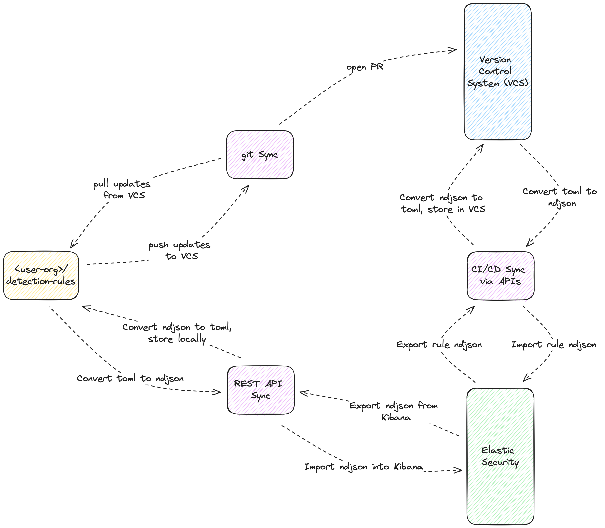

# Core components and Governance Models of DaC

================================

## Core components of Detections as Code

For any DaC implementation, the following core components are required:

1. Maintaining rules within a Version Control System (VCS)
1. Syncing rules from VCS to their respective platform
1. Managing rules within the platform
1. Syncing rules from the platform to VCS

As applied to the **Elastic Security** solution, this breaks down as follows:

1. Maintaining rules within a Version Control System (VCS)
1. Syncing rules from VCS to Elastic Security
1. Managing rules within Elastic Security (consistent with a DaC approach)
1. Syncing rules from Elastic Security to VCS

## Governance Models Dictating the Core Components of DaC

For any DaC implementation, the following governance models are required:

1. VCS as authoritative
1. Platform as authoritative
1. Dual sync between VCS and the platform

As applied to **Elastic Security**, this breaks down as follows:

1. VCS as authoritative
1. Elastic security as authoritative
1. Dual sync between VCS and Elastic Security

## Sub-Components and Options

Some of the core components are composed of smaller chunks of sub-components. These sub-components can consist of several options for implementation. For those core components without sub-components, they can have options as well.

These are the sub-components specific to this guide and the implementation of DaC on Elastic Security rules:

1. Maintaining rules within a Version Control System (VCS)
   1. Unit testing
   1. Rule schema validation
   1. Detection logic validation
   1. Creating detection rules
   1. Rule versioning
1. Exceptions lists and actions
1. Syncing rules from VCS to Elastic Security
1. Managing rules within Elastic Security (consistent with a DaC approach)
1. Syncing rules from Elastic Security to VCS

For details on the various options, refer to those specific core components sections of this guide.

## Detailed Considerations of the Different Governance Models

### VCS as authoritative

#### Overview

When the Version Control System (VCS) serves as the authoritative source, all rule changes originate from VCS, emphasizing a code-first approach to detection rule management. This model supports strict change control and full traceability of rule modifications, which is ideal for teams prioritizing rigorous oversight and auditability of detection rules.

#### Considerations

Choosing VCS as the authoritative source requires establishing stringent procedures for rule creation, modification, and deployment, ensuring that all changes are versioned and reviewed before being synchronized to Elastic Security. This governance model relies heavily on CI/CD pipelines to manage deployments and maintain rule integrity across environments.

##### Consideration 1: Code-First Development

This approach encourages the development and testing of detection rules within the VCS environment before deploying to Elastic Security, ensuring that all changes are reviewed and validated through pull requests and automated checks.

###### Option 1: Pull Request Reviews

| Pros | Cons |
|------|------|
| - Enforces peer reviews, enhancing rule quality.   - Facilitates a comprehensive audit trail for each change. | - Can slow down the deployment process.   - Requires a mature development process and discipline among team members.|

**Steps:**

1. Configure branch protection rules in VCS to require pull requests for changes.
2. Implement CI checks that must pass before merging, including rule validation and automated tests.
3. Require approvals from designated team members on pull requests to ensure compliance and accuracy.
4. Merge approved changes to deploy them automatically to Elastic Security via CI/CD pipelines.

###### Option 2: Automated Rule Testing

| Pros | Cons |
|------|------|
| - Ensures that rules meet all standards before deployment.   - Reduces the risk of deploying faulty or ineffective rules. | - Requires setup and maintenance of testing frameworks.   - Increases the complexity of the CI/CD pipeline.|

**Steps:**

1. Implement unit and integration tests within the CI/CD pipeline to validate rule logic and performance.
2. Configure CI to run these tests automatically on every pull request.
3. Use test results to guide rule approvals and merges.
4. Sync approved and tested rules to Elastic Security automatically.

### Elastic Security as authoritative

#### Overview

In models where Elastic Security is the authoritative source, rule creation and testing occur primarily within the Elastic Security platform. This model suits teams who prefer using the platform's native tools and interfaces for rule management, relying on VCS primarily for backup and version tracking rather than active development.

#### Considerations

The primary challenge in this model is ensuring that changes made directly in Elastic Security are captured and accurately reflected in VCS, maintaining consistency across platforms and providing a backup for disaster recovery.

##### Consideration 1: Platform-First Development

This strategy focuses on leveraging Elastic Security's built-in capabilities for rule management, using VCS as a secondary sync point to ensure that all changes are version-controlled and backed up.

###### Option 1: Direct Rule Management in Elastic Security

| Pros | Cons |
|------|------|
| - Utilizes the user-friendly interface of Elastic Security for rule management.   - Immediate deployment and testing within the platform. | - Higher risk of changes not being captured in VCS.   - Dependence on manual processes for syncing to VCS.|

**Steps:**

1. Develop and modify detection rules directly in Elastic Security.
2. Periodically export rules from Elastic Security to a local directory or directly into VCS.
3. Use scripts or CI/CD jobs to automate the export and commit process to VCS.
4. Review and back up changes in VCS to ensure all modifications are captured.

###### Option 2: Scheduled Sync to VCS

| Pros | Cons |
|------|------|
| - Automates the synchronization process, reducing manual overhead.   - Ensures consistent backups in VCS. | - May introduce a delay between rule creation in Elastic Security and its reflection in VCS.   - Requires reliable scheduling and monitoring of sync processes.|

**Steps:**

1. Implement a scheduled job to export rules from Elastic Security to VCS.
2. Configure the job to run at regular intervals, e.g., daily or weekly.
3. Monitor sync processes and logs to catch and resolve any failures or discrepancies.
4. Review VCS periodically to confirm that it accurately reflects the current state of rules in Elastic Security.

These sections expand on the governance models by detailing specific considerations and options for each model, maintaining consistency with the established format of providing practical steps and weighing the pros and cons.

### Dual Syncing Rules and Data between Kibana and VCS

#### Overview

Dual syncing between Elastic Security and a Version Control System (VCS) embodies the preferred method for managing detection rules, merging the operational efficiency of Elastic Security with the structured control of VCS. This advanced strategy ensures that any rule modifications in Elastic Security are accurately reflected in VCS and vice versa, supporting a cohesive rule management ecosystem. It allows analysts to use the intuitive Elastic Security UI and detection engineers to leverage VCS for rule development, with critical syncing occurring ideally within Continuous Integration (CI) workflows. This approach is designed to abstract the complexities of rule versioning and syncing from detection engineers, ensuring that they can focus on rule quality and effectiveness.

|                                                                                        |
| -------------------------------------------------------------------------------------- |
|  |
| 
*Figure 2: Combining Multiple Options to Dual Sync Rules* 
                                    |

#### Considerations

Implementing a dual syncing strategy requires careful planning and consideration of several factors to ensure its success. A successful dual syncing strategy involves integrating automation tools to handle the bidirectional flow of rule data. It requires a robust setup that can automatically compare rules by version or hash, ensuring that updates made within Elastic Security are synchronized back into VCS before final deployment. Utilizing the version lock file from the detection rules repository, or a bespoke versioning system, plays a pivotal role in managing this synchronization process seamlessly. Additionally, team-specific processes may be required to ensure production rules remain in sync.

##### Consideration 1: Syncing Processes

Leveraging automation tools and CI/CD pipelines facilitates a constant sync between Elastic Security and VCS. This setup should include processes for pulling rules from Elastic Security, comparing them against the VCS repository (either by version or hash), and ensuring updates are committed back into VCS. This ensures that both Elastic Security and VCS maintain the latest rule versions, abstracting this process from detection engineers.

###### Option 1: Automation Tools for Syncing

| Pros | Cons |
| - | - |
| - Minimizes manual intervention, automating rule synchronization.   - Supports collaborative rule development with integrated version control. | - Requires significant initial setup and maintenance of automation scripts and CI/CD pipelines.   - Potential for configuration complexities and the need to handle merge conflicts or discrepancies between the two environments.|

**Steps:**

1. Set up CI/CD pipelines with triggers for rule changes in both Elastic Security and VCS.
1. Utilize Elastic Security's Detection Engine APIs for rule exports and imports.
1. Configure scripts to handle rule format conversions, versioning, and conflict resolution between syncing.
1. Regularly monitor and test the synchronization process to identify and rectify any versioning issues.

###### Option 2: Pre-Merge Sync

Incorporate a sync check step within the PR workflow, running an automated job to compare rule versions or hashes between Elastic Security and VCS. This step aims to identify and resolve any discrepancies before merging changes into the main branch or deploying rules to production. It serves as a final check to ensure all rules are correctly synchronized and ready for deployment.

| Pros | Cons |
| - | - |
| - Ensures a final validation of rule synchronization, enhancing rule integrity before production deployment.   - Streamlines the resolution of any version conflicts or discrepancies, maintaining rule consistency. | - Introduces potential delays in rule synchronization due to the manual review process.   - Requires clear documentation and understanding of the sync process among team members. |

**Steps:**

1. Integrate a sync check script into the CI/CD pipeline, triggered as part of the PR process.
2. The script compares rule data between Elastic Security and VCS, highlighting discrepancies for resolution.
3. Resolve any conflicts or discrepancies identified by the sync check before merging the PR.
4. Upon successful sync check completion, proceed with merging the PR and deploying the rules to production.
