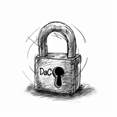
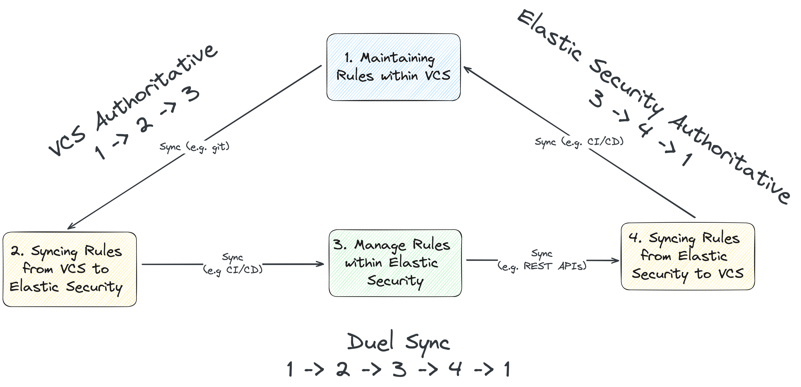

# DaC Concept and Workflows
================================

## Overview
Detection as Code (DaC) is a modern security approach that applies
software development best practices to the creation, management, and
deployment of security rules. By treating “detections” as traditional
code, organizations can leverage version control systems (VCS), automate
testing and deployment processes, and ensure consistency across their
security information and event management (SIEM) and endpoint detection
and response (EDR) capabilities. This methodology enhances collaboration
among security teams, streamlines updates, and facilitates a more agile
response to evolving threats.

    

DaC adoption is driven by several factors:

- Ever-Growing Rule Sets: Maintaining detection rules without DaC
  becomes untenable as the number of rules increases.

- Expanding Threat Landscape: The breadth of coverage needed to protect
  against emerging threats necessitates a scalable approach suitable for
  diverse skill sets amongst the team.

- Drive Towards Security Team Maturity: Implementing DaC encourages the
  development of mature, repeatable processes within security teams. It
  supports the maintenance of high-quality detections through systematic
  peer reviews and rigorous testing.

- Broader Adoption of Automation: The wider movement towards automation
  in technology environments, exemplified by the adoption of
  Infrastructure as Code (IaC) principles, calls for enhanced automation
  capabilities across all tools used by security teams. DaC aligns with
  this trend by integrating rule management into automated workflows,
  ensuring consistency, efficiency, and the ability to swiftly respond
  to new threats.

- Compliance and Governance Requirements: Many organizations are
  adopting DaC to meet certification compliance requirements for peer
  review, change control, and disaster recovery of SIEM detections.
  Implementing DaC ensures that security rules are developed, reviewed,
  and maintained following strict governance standards, providing
  auditable evidence of compliance.

## Applying DaC Principles to Rules in Elastic

Incorporating DaC principles into Elastic Security rules management
workflows involves using VCS to track rule changes, employing continuous
integration (CI) tools for validation and testing, and continuous
deployment (CD) mechanisms to update detection rules within
[<u>Kibana</u>](https://www.elastic.co/guide/en/kibana/current/introduction.html)’s
Elastic Security seamlessly. This practice ensures that rule changes are
systematically reviewed, tested and enables rapid deployment of updates
to respond to new vulnerabilities and attack techniques.

###  Prerequisites

To effectively apply DaC principles to Elastic Security, individuals or
teams should have a foundational understanding of several key concepts
and technologies:

- Version Control Systems (VCS): Familiarity with VCS and tools (e.g.
  particularly Git), is crucial for tracking changes to detection rules
  and collaborating on rule development.

- Continuous Integration and Continuous Deployment (CI/CD): Knowledge of
  CI/CD pipelines and how they facilitate automated testing and
  deployment processes.

- Elastic Security: An understanding of how Elastic Security functions,
  including creating and managing detection rules within Elastic
  Security.

- Elastic Prebuilt Rules repository: Exposure to the detection-rules
  repo

- Scripting and Automation: Basic proficiency in scripting (e.g.,
  Python, Shell) to automate rule deployment and management tasks.

### Who Will Benefit from This Guide

This guide is for security analysts, engineers, and architects who
develop, deploy, and manage detection rules within Elastic Security
environments. It is particularly beneficial for:

- Security Analysts who wish to leverage automation for more efficient
  rule management and to respond more rapidly to emerging threats.

- Detection Engineers looking for methodologies to streamline detection
  logic development, testing, and deployment.

- Security Team Leads seeking to implement best practices for rule
  version control, collaboration, and quality assurance within their
  teams.

- DevOps Engineers involved in integrating security practices into CI/CD
  pipelines, aiming for a more cohesive and automated approach to
  security within their workflows.

- IT Security Architects exploring ways to incorporate as-code
  principles into security operations to enhance agility, repeatability,
  and reliability.

There are many ways to implement DaC within Elastic Security ecosystems,
but this reference provides a few examples to convey the core
principles. It delineates various approaches and architectures to
building DaC, catering to different operational models and
organizational needs. By navigating through this reference, individuals
will gain the insights and practical know-how to establish robust DaC
workflows, leading to more streamlined security operations, enhanced
collaboration across teams, and a solid foundation for integrating
security practices within automated CI/CD pipelines.

## Managing Detection Rules in Elastic Security vs VCS

While Elastic Security provides a user-friendly interface for creating
and managing detection rules, integrating these rules with a VCS
capability offers several advantages. VCS allows for detailed tracking
of rule changes, collaborative rule development, and the integration of
rule management into broader CI/CD workflows. This reference
documentation heavily biases the direct management of rules utilizing
VCS alongside the **detection-rules** repository to enhance detection
rule lifecycle management. It offers high-level alternative options to
considering posterity, but does not recommend implementing all of them.

## How to use this reference

This resource describes principles to adopt a DaC approach to Elastic
Security rule management. Whether you're looking to automate rule
deployments, enhance rule validation processes, or streamline rule
versioning and exception management, this guide offers a modular set of
practices and components. Select and combine the options relevant to
your specific needs and operational context to customize your detection
rule management workflow.

When considering adopting a DaC approach, several discrete components
should be taken into consideration. This viewpoint helps identify the
high-level requirements for implementing DaC end-to-end while
reinforcing the modular approach. This reference includes an explanation
of the different options, with any specific implications across these
components. See the DaC Diagram and Delineation table for more
information on how these components overlap.

Note: Jump to the [<u>quickstart</u>](#quickstart) section to get up and
running quickly.

### Core Workflows to Implement DaC within Elastic

1.  Maintaining rules within a Version Control System (VCS)

2.  Syncing rules from VCS to Elastic Security

3.  Managing rules within Elastic Security (consistent with a DaC
    approach)

4.  Syncing rules from Elastic Security to VCS

5.  Dual sync between VCS and Elastic Security (optional)

## Overall Elastic DaC Diagram

|                                                                         |
| ----------------------------------------------------------------------- |
|  |
| *Figure x: High-level components*                                       |

This diagram serves as a visual guide to the three primary environments
where security rules are maintained:

1.  Locally within a cloned repository, as indicated by the
    **user-org/detection-rules** component.

2.  In various version control environments, such as GitHub, GitLab,
    Bitbucket, or Gitea, denoted by the **VCS** component.

3.  Within the **Elastic Security platform**.

The diagram also outlines the synchronization methods between these
environments:

- **Git Sync**, which manages the transfer of rules between the local
  repository and the VCS.

- **CI/CD Sync via APIs**, which handles the deployment and updating of
  rules from the VCS to Elastic Security.

- **REST API Sync**, which facilitates direct communication and rule
  synchronization between the local clone and Elastic Security.

This reference explains multiple strategies for synchronizing rules
between the components. Depending on the chosen method, syncing may
involve pushing rules from a local repository or VCS to Elastic Security
or pulling rules from Elastic Security to be merged into the VCS or
local repositories, ensuring that changes replicate across the
development, version control, and operational environments.

## High-Level Workflow Delineation

| Workflow Topic                                                   | Description                                                                                                                       | Requirements                                                                                    | Key Steps                                                                                                                                                  |
| ---------------------------------------------------------------- | --------------------------------------------------------------------------------------------------------------------------------- | ----------------------------------------------------------------------------------------------- | ---------------------------------------------------------------------------------------------------------------------------------------------------------- |
| **Maintaining Rules within VCS**                                 | Involves version control, collaboration, and historical tracking of detection rules within a VCS.                                 | - Access to a VCS - Forked or cloned detection-rules repository                              | - Fork/clone the detection-rules repo - Create, validate, and unit test rules, actions/exceptions list using CLI - Commit and push updates regularly |
| **Syncing Rules from VCS to Elastic Security**                   | Covers the automated or manual processes of deploying or updating rules in Elastic Security from VCS.                             | - API access to Elastic Stack - Authentication credentials - CI/CD pipeline (optional)    | - Import rules into Elastic Security using CLI or API - Configure CI/CD for automated syncing                                                           |
| **Managing Rules within Elastic Security (consistent with DaC)** | Focuses on creating, testing, and managing rules directly in Elastic Security while considering backup and versioning strategies. | - Elastic Security access with permissions - Knowledge of Elastic Security's UI              | - Directly create, modify, and manage rules in Elastic Security - Manually export rules for backup/version control                                      |
| **Syncing Rules from Elastic Security to VCS**                   | Describes exporting and versioning rules from Elastic Security back into VCS for tracking and collaboration.                      | - Scripting for API interaction - Authentication - CI/CD setup for automation (optional)  | - Export rules using Detection Engine API - Commit exported rules into VCS - Use CI/CD workflows to automate the process                             |
| **(Optional) Dual Sync Between VCS and Elastic Security**        | Highlights a hybrid approach that ensures rules are synchronized and up-to-date in both Elastic Security and VCS.                 | - Setup for bidirectional syncing - Authentication - Access - Automation tools/scripts | - Establish sync process for both directions - Automate sync using CLI, API, and CI/CD - Regularly review and reconcile discrepancies                |
