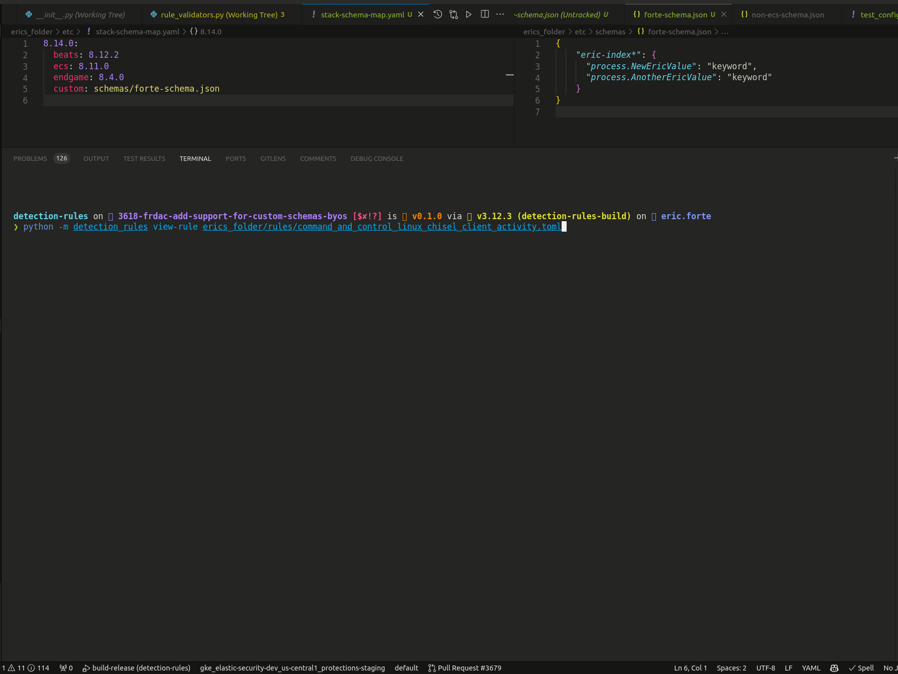

# Frequently Asked Questions

Here are some frequently asked questions about Detections as Code (DaC). There are known [limitations](./known_limitations.md), so please review if you do not see your question answered here. More questions and answers will be added over time to address common queries and concerns.

**Q1:** What is Detections as Code (DaC)?

**A1**: Detections as Code is a methodology that applies software development practices to the creation, management, and deployment of security detection rules. By treating detection rules as code, it enables version control, automated testing, and deployment processes, enhancing collaboration, consistency, and agility in response to threats.

**Q2**: How does DaC benefit my security team?

**A2**: DaC streamlines the detection rule lifecycle, ensuring high-quality detections through peer reviews and automated tests. It facilitates a scalable approach to managing an ever-growing number of detection rules and adapting quickly to the evolving threat landscape. This methodology supports compliance with change management requirements and fosters a mature security posture.

**Q3**: Can I integrate DaC with my existing CI/CD pipelines?

**A3**: Yes, DaC is designed to integrate seamlessly with existing CI/CD pipelines. By leveraging the detection-rules repository and its tooling within your CI/CD workflows, you can automate the testing, validation, and deployment of detection rules directly into Elastic Security or other SIEM platforms.

**Q3**: How can setup and use an API Key for authentication with the stack?

**A3**: There are a number of different ways to create an API key but the most straightforward approach is to make an API key tied to an existing user. The API Key's scope is then limited to the level of access provided to that user. See the video below for a walkthrough.

**Q4**: What are the prerequisites for adopting DaC with Elastic?

**A4**: To adopt DaC, you'll need access to the Elastic detection-rules repository, a version control system (like GitHub), and familiarity with CI/CD principles and tools. Basic knowledge of Elastic Security and its API is also beneficial for customizing and deploying rules.

**Q5**: How do I start using DaC in my organization?

**A5**: Begin by exploring the detection-rules repository and familiarizing yourself with its structure and tooling. Consider your governance model (VCS as authoritative, Elastic Security as authoritative, or dual sync) and plan your workflow accordingly. Experiment with the main branch to test new features and configurations that suit your needs.

**Q6**: Are there any resources available for learning more about DaC?

**A6**: Elastic provides comprehensive documentation, reference guides, and slide decks to help you understand and implement DaC. Joining the Elastic community forums and Slack channels, such as #security-rules-dac, can also provide valuable insights and support from fellow users and Elastic experts.

**Q7**: How can I contribute to the DaC methodology or detection-rules repo?

**A7**: Contributions are welcome! You can contribute by testing the DaC features, reporting issues, suggesting enhancements, or sharing your own use cases and scripts. Contributions help improve DaC for everyone and are a great way to give back to the community.

**Q8**: How should exception & action files be deployed to Kibana?

**A8**: Currently, there two approaches.

1. You could directly add the correct exception or action item in the toml files themselves. We have two fields available: `actions: Optional[list]` and `exceptions_list: Optional[list]`. This approach is a bit difficult because we do not define the entire schema for these fields that are expected by Kibana. It's not really a feature we use within our prebuilt ruleset, so its left open to the user to properly supply the correct fields and format.
2. The second approach to define the actions and /or exceptions directories in the `_config.yaml`. This will load action list toml files or exception list toml files defined in their folders. These toml files will have the `rule id`  mapping so you know which list are associated to the rule. When you upload rules to kibana, it will automatically bring the defined exception/action lists.

Note this is one way at the moment (toml --> kibana). So you can not export lists and import them into toml files.


**Q9**: Is there a way to run the unit tests only on `custom_rules_dir`?

**A9**: Yes, there are a few options you have when it comes to doing this. For more reference material, see our [custom-rules.md](https://github.com/elastic/detection-rules/blob/main/docs/custom-rules.md).

If you already have your custom rules directory for reference and appropriate config files setup you can skip this step.
First, generate a base set of configs and custom rules directory using our helper command
`python -m detection_rules custom-rules setup-config <new_directory_name>`

Set the environment variable `CUSTOM_RULES_DIR` to the path of you custom rules directory. At this point the rule loading will pull from the rules folders specified in the `<new_directory_name>_config.yaml`.

The default behavior now is for the unit tests to be run on only the rules directories specified in that config file.
You can further customize the unit tests configuration (ignoring specific tests, etc.) in the `<new_directory_name>/etc/test_config.yaml`


**Q10**: I want to use `export-rules-from-repo`in CI/CD to convert a new/modified rule from TOML to JSON and push the JSON to Kibana API. What is the best way to do that?

**A10**: You may be able to use `import-rules` to simplify this process.

The `export-rules-from-repo` command is not the required method for uploading rules to Kibana, just another option for those who may wish to use ndjson.
For instance, in this setup I have a local directory specific in my `CUSTOM_RULES_DIR` config.

If I want to modify it and upload it to Kibana, I can directly use the `import-rules` command with the `--overwrite` flag to trigger the update from TOML directly into Kibana.
Command: `python -m detection_rules kibana import-rules --overwrite`. You can also specify a directory or specific file here too in addition to the config.

 


**Q11**: When using custom schemas, do I have to declare all fields or only those that are not part of the ecs?

**A11**: You do not have to declare all the fields, just the ones not part of the ecs.

Custom Schema fields are treated as additional non-ecs fields, in effect this means your custom schema(s) values are added as additional available options that should be considered as valid. Here is an example that might be useful.

I want to add 2 new keyword fields to process that I want to be considered as valid for a specific index. First I need to modify my `stack-schema-map.yaml` to specify a custom schema file I want to add as additional fields to validate against my target stack version (in this case 8.14.0).

```
8.14.0:
  beats: 8.12.2
  ecs: 8.11.0
  endgame: 8.4.0
  custom: schemas/custom-schema.json
```

Now I need to populate `schemas/custom-schema.json` with my desired keywords for my index. Here is an example of what this would look like:

```
{
    "custom-index*": {
      "process.NewValue": "keyword",
      "process.AnotherValue": "keyword"
    }
}
```

With this custom schema defined I can now make an example rule that I would like to validate. The quickest way to do this is to create the toml rule file and run the `view-rule` command which parse the rule file and validate it against the specified schemas (including custom schemas specified in your config)

Here is an example rule using the above schema:
```
[metadata]
creation_date = "2023/08/23"
integration = ["endpoint"]
maturity = "production"
min_stack_comments = "New fields added: required_fields, related_integrations, setup"
min_stack_version = "8.3.0"
updated_date = "2024/03/08"

[rule]
author = ["Elastic"]
description = """
Test Rule
"""
from = "now-9m"
index = ["logs-endpoint.events.*", "custom-index*"]
language = "eql"
license = "Elastic License v2"
name = "TEST Potential Protocol Tunneling via Chisel Client"
note = """Test Note"""
references = [
    "https://blog.bitsadmin.com/living-off-the-foreign-land-windows-as-offensive-platform",
    "https://book.hacktricks.xyz/generic-methodologies-and-resources/tunneling-and-port-forwarding"
    ]
risk_score = 47
rule_id = "e8e3af2a-11b8-4ab7-9ca1-c6db621ea89d"
setup = """Test Setup"""
severity = "medium"
tags = [
        "Domain: Endpoint",
        "OS: Linux",
        "Use Case: Threat Detection",
        "Tactic: Command and Control",
        "Data Source: Elastic Defend"
        ]
type = "eql"
query = '''
process where host.os.type == "linux" and process.NewValue == "GoodValue"
'''
timestamp_override = "event.ingested"

[[rule.threat]]
framework = "MITRE ATT&CK"

[[rule.threat.technique]]
id = "T1572"
name = "Protocol Tunneling"
reference = "https://attack.mitre.org/techniques/T1572/"

[rule.threat.tactic]
id = "TA0011"
name = "Command and Control"
reference = "https://attack.mitre.org/tactics/TA0011/"
```

Running `view-rule` on this rule should look similar to the following. When the custom schema is specified, the schema validation should pass and the contents should be printed. If the custom schema is removed, the validation should fail and an error message should appear.

 


For more information on how you can also automatically generate the custom schemas please see [Option 3: Custom Schema Validation](https://dac-reference.readthedocs.io/en/latest/internals_of_the_detection_rules_repo.html#option-3-custom-schema-validation)