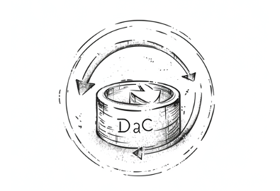

# Feedback and Resources

================================

## Feedback

We’re always interested in hearing from the community and our partners! If you have use cases, workflows, or any feedback related to Detection as Code (DaC), we encourage you to share them with us. Your input is crucial for continuous improvement and fostering a collaborative environment. Please reach out through the following channels:

- [GitHub Issues](https://github.com/elastic/detection-rules/issues): For technical issues, enhancements, or feature requests.
- [Community Slack](http://ela.st/slack): Join our conversations for real-time discussions.
- [Discuss Forums](https://discuss.elastic.co/c/security/endpoint-security/80): Post your questions, share insights, and engage with the Elastic community.

## Updates and Next Steps

As the cybersecurity landscape evolves, so does the need for adaptable and robust security practices. Detection as Code is a dynamic approach, continuously refined through community feedback, technological advancements, and the ever-changing threat environment. We're committed to updating this documentation with the latest methodologies, tools, and best practices as we adopt them. Stay tuned for updates, and consider contributing to the development of these workflows.

## Resources

- [6 Lessons on Everything as Code](https://techbeacon.com/enterprise-it/6-lessons-everything-code-shift)
- [Automating Detection as Code](https://www.tines.com/blog/automating-detection-as-code)
- [Building a Detection as Code Pipeline](https://medium.com/threatpunter/from-soup-to-nuts-building-a-detection-as-code-pipeline-59b96c875ca1)
- [Can We Have Detection as Code?](https://medium.com/anton-on-security/can-we-have-detection-as-code-96f869cfdc79)
- [Detection as Code: A Maturity Framework](https://catscrdl.io/blog/detectionascodematurity/)
- [Detection as Code Explained](https://panther.com/cyber-explained/detections-as-code/)
- [Detection as Code on Splunk Blog](https://www.splunk.com/en_us/blog/learn/detection-as-code.html)
- [Detection as Code: Detection Development Using CI/CD](https://www.jedi.be/blog/2022/02/23/trends-and-inventory-of-50-as-code-concepts/?ref=hackernoon.com)
- [Everything as Code Explained](https://hackernoon.com/everything-as-code-explained-0ibg32a3)
- [Getting Started with Detection as Code and Chronicle Security](https://www.googlecloudcommunity.com/gc/Community-Blog/Getting-Started-with-Detection-as-Code-and-Chronicle-Security/ba-p/702154?nobounce)
- [Infrastructure as Code (IaC) Guide by Turing](https://www.turing.com/blog/infrastructure-as-code-iac-guide/)
- [Infrastructure as Code 101 by env0](https://www.env0.com/blog/infrastructure-as-code-101)
- [Infrastructure as Code on Wikipedia](https://en.wikipedia.org/wiki/Infrastructure_as_code)
- [Infrastructure as Code Overview by Microsoft](https://learn.microsoft.com/en-us/devops/deliver/what-is-infrastructure-as-code)
- [The Detection as Code (DaC) Approach to Cybersecurity](https://web.archive.org/web/20221129120955/https://softtek.eu/en/tech-magazine-en/cybersecurity-en/the-detection-as-code-dac-approach-to-cybersecurity/)
- [The GitHubification of InfoSec](https://medium.com/@johnlatwc/the-githubification-of-infosec-afbdbfaad1d1)
- [What is Everything as Code](https://octopus.com/blog/what-is-everything-as-code)
- [What is Infrastructure as Code (IaC)?](https://www.redhat.com/en/topics/automation/what-is-infrastructure-as-code-iac)

These resources provide a comprehensive overview of the DaC concept, its applications, and broader discussions around 'as Code' practices in the tech industry. Whether you're a beginner or an experienced practitioner, these readings offer valuable insights into modern rule management and DAC practices.
