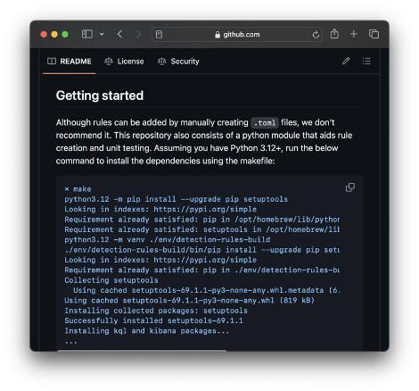

# Internals of the detection-rules Repo and How it is Used Internally

================================

## Overview of Elastic Detection Rules Repo and Usage

[Figure 3](#figure3) illustrates the reference architecture, detailing how components integrate end-to-end. Users initiate the process by forking the **detection-rules** repository, configuring it to support custom rules and testing, and then establishing the release mechanism to synchronize rules with the Elastic Security system. This section outlines key components considered for managing rules in a Version Control System (VCS) and how the **detection-rules** repository facilitates this process. The repository's components are segmented into independent parts, each provided with detailed guidance for effective rule management.

|                                                                                                                   |
| ----------------------------------------------------------------------------------------------------------------- |
|  |
| <center>*Figure 3: High-level components* </center>                                                               |

## Getting Started with the Repo

This section covers the **detection-rules** repo, how to install prerequisites, and the overall contents, which is a prerequisite to using many of the subsequent steps and components.

**Steps:**

1. Navigate to the [detection-rules](https://github.com/elastic/detection-rules) repo. Here you will find the repository information to ***fork*** the repository

|                                                                                                                   |
| ----------------------------------------------------------------------------------------------------------------- |
|  |
| <center>*Figure 4: detection-rules Repo* </center>                                                               |

1. Follow GitHub’s [instructions](https://docs.github.com/en/pull-requests/collaborating-with-pull-requests/working-with-forks/fork-a-repo) to ***fork and clone*** the detection-rules repo.
1. Download and install [Python](https://www.python.org/downloads/). Note: Versions *3.12+* are supported.
1. Install the detection-rules python **CLI** prerequisites. Installing essentially requires you to change to the new directory and use pip to install. **cd detection-rules -> make** (optionally install direct using: **pip install “[.dev]”**) See the [README](https://github.com/elastic/detection-rules/blob/main/README.md) for more details.


|                                                                                                                   |
| ----------------------------------------------------------------------------------------------------------------- |
|  |
| <center>*Figure 5: detection-rules Getting Started* </center>                                                               |

💡 Note: We recommend using a [Python virtual environment](https://docs.python.org/3/library/venv.html) for a cleaner management experience.

The repo contains code for unit testing in Python, integrating with the security solution in Elastic Security via [APIs](https://www.elastic.co/guide/en/security/current/security-apis.html) , Red Team Automation (RTA) to emulate attack techniques, and a miscellaneous directory that contains schemas used for query validation.

### Repo Structure

| Folder                | Description                                                                                                      |
|-----------------------|------------------------------------------------------------------------------------------------------------------|
| detection_rules/      | Python module for rule parsing, validating, and packaging. Also includes miscellaneous files, such as ECS and Beats schemas |
| doc/                  | Documentation on rule management and other useful tips                                                         |
| kibana/               | Python library for handling the API calls to Elastic Security and the Detection Engine                           |
| kql/                  | Python library for parsing and validating Kibana Query Language                                                  |
| rta/                  | Red Team Automation code used to emulate attacker techniques, used for rule testing                              |
| rules/                | Root directory where rules are stored                                                                            |
| rules_building_block/ | Root directory where building block rules are stored                                                             |
| tests/                | Python code for unit testing rules                                                                                |

The miscellaneous folder [detection_rules/etc](https://github.com/elastic/detection-rules/tree/main/detection_rules/etc) contains our schemas used for validation, our versioning files used to track rule changes, and our stack-schema-map.yaml file which instructs our validation to run on specific Elastic Security environment and schema version combinations. When electing to fork the detection-rules repo and manage rules in a **CUSTOM_DIR**, these files enable additional customization and workflows to test and validate rules. Not all files are included in the table, however the more prominent ones are highlighted below.

| File                   | Description                                                                                                      |
|------------------------|------------------------------------------------------------------------------------------------------------------|
| deprecated_rules.json  | Version file containing a reference of all deprecated rules                                                     |
| packages.yaml          | Package used to build a fleet package                                                                            |
| rule-mapping.yaml      | Mapping file used to map detection rules to RTAs                                                                 |
| version.lock.json      | Master version lock file used to track the version of a rule based on sha256 calculation                        |
| integration-*.json.gz  | Files used to validate rules against Elastic integration schemas                                                 |

💡 *Note: View the schemas and dataclass section to view the schema files and folders table.*

## CLI

The detection-rules Python command line interface (CLI) is designed initially to support internal Elastic rule management, however, it also includes DaC options to manage custom rules. Users can manage rules locally to validate their TOML files against the defined schema dataclasses, interact with Elastic Security to sync rule updates, or even execute RTAs just to name a few. See the [CLI.md](https://github.com/elastic/detection-rules/blob/main/CLI.md) for more details.

The CLI contains more options than needed to perform standard DAC operations. Therefore, we have grouped the relevant DAC commands under <name>.

**Steps:**

1. Confirm prerequisites are installed by loading the help. For an exhaustive list of options run **python -m detection_rules -h** in the terminal.

```bash

█▀▀▄ ▄▄▄ ▄▄▄ ▄▄▄ ▄▄▄ ▄▄▄ ▄▄▄ ▄▄▄ ▄   ▄      █▀▀▄ ▄  ▄ ▄   ▄▄▄ ▄▄▄
█  █ █▄▄  █  █▄▄ █    █   █  █ █ █▀▄ █      █▄▄▀ █  █ █   █▄▄ █▄▄
█▄▄▀ █▄▄  █  █▄▄ █▄▄  █  ▄█▄ █▄█ █ ▀▄█      █ ▀▄ █▄▄█ █▄▄ █▄▄ ▄▄█

Usage: detection_rules [OPTIONS] COMMAND [ARGS]...

  Commands for detection-rules repository.

Options:
  -D, --debug / -N, --no-debug  Print full exception stacktrace on errors
  -h, --help                    Show this message and exit.

Commands:
  build-limited-rules     Import rules from json, toml, or Kibana...
  build-threat-map-entry  Build a threat map entry.
  create-rule             Create a detection rule.
  custom-rules            Commands for supporting custom rules.
  dev                     Commands related to the Elastic Stack rules...
  es                      Commands for integrating with Elasticsearch.
  export-rules-from-repo  Export rule(s) into an importable ndjson file.
  generate-rules-index    Generate enriched indexes of rules, based on a...
  import-rules-to-repo    Import rules from json, toml, yaml, or Kibana...
  kibana                  Commands for integrating with Kibana.
  mass-update             Update multiple rules based on eql results.
  normalize-data          Normalize Elasticsearch data timestamps and sort.
  rta                     Commands related to Red Team Automation (RTA)...
  rule-search             Use KQL or EQL to find matching rules.
  test                    Run unit tests over all of the rules.
  toml-lint               Cleanup files with some simple toml formatting.
  typosquat               Commands for generating typosquat detections.
  validate-all            Check if all rules validates against a schema.
  validate-rule           Check if a rule staged in rules dir validates...
  view-rule               View an internal rule or specified rule file.
```

💡 *Note: Using some of these options with your custom rules requires repo configuration.*

2. Explore the **Custom Rules** CLI commands by running **python -m detection_rules custom-rules setup-config -h** in the terminal.

```bash
█▀▀▄ ▄▄▄ ▄▄▄ ▄▄▄ ▄▄▄ ▄▄▄ ▄▄▄ ▄▄▄ ▄   ▄      █▀▀▄ ▄  ▄ ▄   ▄▄▄ ▄▄▄
█  █ █▄▄  █  █▄▄ █    █   █  █ █ █▀▄ █      █▄▄▀ █  █ █   █▄▄ █▄▄
█▄▄▀ █▄▄  █  █▄▄ █▄▄  █  ▄█▄ █▄█ █ ▀▄█      █ ▀▄ █▄▄█ █▄▄ █▄▄ ▄▄█

Usage: detection_rules custom-rules setup-config [OPTIONS] DIRECTORY
                                                 [KIBANA_VERSION]

  Setup the custom rules configuration directory and files with defaults.

Options:
  --overwrite  Overwrite the existing _config.yaml file.
  -h, --help   Show this message and exit.
```

💡 *Note: Using these options with your custom rules requires repo configuration and the Elastic Security Solution available.*

## Unit tests

The detection-rules repository's unit tests serve as a comprehensive mechanism to verify the compatibility of rules with the expected format and structure for Elastic Security. These tests ensure consistency in rule management and adherence to best practices as defined by Elastic's detection engineering team. By loading all rules simultaneously, the tests efficiently iterate over the rule set to evaluate various cases, from syntax validation to logical consistency.

💡 *Note: Additional unit testing options and details are available in [Sub-Component 6: Unit Testing](#unit-testing).*

**Steps:**

1. Run the unit tests to confirm all prebuilt rules are passing the test cases. The CLI provides an option to run the unit tests and format the output using the pytest python module. Run **python -m detection_rules test** to run all tests. (alternative options for invoking unit tests include: **make test**, **pytest [tests]**, **unittest [tests]**)

```bash
(detection_dev) ➜  detection-rules git:(main) ✗ python -m detection_rules test
Loaded config file: /Users/stryker/workspace/ElasticGitHub/detection-rules/.detection-rules-cfg.json

█▀▀▄ ▄▄▄ ▄▄▄ ▄▄▄ ▄▄▄ ▄▄▄ ▄▄▄ ▄▄▄ ▄   ▄      █▀▀▄ ▄  ▄ ▄   ▄▄▄ ▄▄▄
█  █ █▄▄  █  █▄▄ █    █   █  █ █ █▀▄ █      █▄▄▀ █  █ █   █▄▄ █▄▄
█▄▄▀ █▄▄  █  █▄▄ █▄▄  █  ▄█▄ █▄█ █ ▀▄█      █ ▀▄ █▄▄█ █▄▄ █▄▄ ▄▄█

================================================== test session starts ==================================================
platform darwin -- Python 3.11.5, pytest-7.4.2, pluggy-1.3.0 -- /Users/stryker/.virtualenvs/detection_dev/bin/python
cachedir: .pytest_cache
rootdir: /Users/stryker/workspace/ElasticGitHub/detection-rules
configfile: pyproject.toml
plugins: typeguard-3.0.2
```

💡 *Note: You can optionally run **pytest** to run the tests.*

2. Running all test cases may not be desirable. In this case, you can configure the unit tests glob-style by creating a test config and specifying the test cases. More details are provided in the [Sub-Component 6: Unit Testing](#unit-testing) section.  For further troubleshooting or unit test customization, refer to the **pytest** module documentation, which the CLI leverages to run tests and format outputs.

## Schemas and Data Structures

The repository extensively utilizes schemas sourced from upstream (e.g., Beats, ECS, integrations) for validating detection logic fields and values, compatible with the defined datasource (indexes or data views). Additionally, Python dataclasses define the various rule types as schema objects along with the use of marshmallow, which provides validation of the rule structure. There also is several conversion methods, which facilitate the TOML rules' formatting and their conversion to the expected format by Kibana, for import/export processes with Elastic Security. These components work in tandem to ensure detection rules are both structurally sound and functionally accurate.

**Steps:**

1. Explore the [rule dataclasses](https://github.com/elastic/detection-rules/blob/main/detection_rules/rule.py) detailed in the repository to understand the expected format for rule definitions. These are periodically updated to reflect new capabilities within the Kibana features set.

```python
@dataclass(frozen=True)
class RuleMeta(MarshmallowDataclassMixin):
    """Data stored in a rule's [metadata] section of TOML."""
    creation_date: definitions.Date
    updated_date: definitions.Date
    deprecation_date: Optional[definitions.Date]

    # Optional fields
    bypass_bbr_timing: Optional[bool]
    comments: Optional[str]
    integration: Optional[Union[str, List[str]]]
    maturity: Optional[definitions.Maturity]
    min_stack_version: Optional[definitions.SemVer]
    min_stack_comments: Optional[str]
    os_type_list: Optional[List[definitions.OSType]]
    query_schema_validation: Optional[bool]
    related_endpoint_rules: Optional[List[str]]
    promotion: Optional[bool]

    # Extended information as an arbitrary dictionary
    extended: Optional[Dict[str, Any]]
```

2. Visit the etc/ directory within the repository to review additional resources, including validation schemas and configuration files required for rule management and development.

| File / Folder                | Description                                                                                          |
|-----------------------------|------------------------------------------------------------------------------------------------------|
| api_schemas/                | JSON schemas used to aid rule downgrade migrations                                                   |
| beats_schemas/              | JSON schemas used within query validation for all beats’ versions                                   |
| ecs_schemas/                | JSON schemas used within query validation for all ECS versions                                      |
| endgame_schemas/            | JSON schemas used within query validation for multiple Endgame versions                            |
| endpoint_schemas/           | JSON schema used within query validation for all endpoint schemas                                   |
| attack-v13.1.0.json.gz      | MITRE ATT&CK mapping file to validate threat mapping within the detection rule TOML file            |
| integration-manifests.json.gz | Manifest of integrations used to determine which integration schemas to download                   |
| integration-schemas.json.gz  | JSON schema used within query validation for all integration schemas used within the TOML files    |
| stack-schema-map.yaml       | Mapping of all Elastic Security version / schema combinations to perform query validation          |
| non-ecs-schema.json         | JSON schema for all fields not mapped in any other schema                                           |

3. To update these schemas, use the built-in CLI integration commands to update the manifest and download the schemas.

```bash
python -m detection_rules dev integrations build-manifests
python -m detection_rules dev integrations build-schemas
```

## Incorporating Custom Rules

### Option 1: Using the Built-In Configuration

This method involves creating a custom directory within your forked version of the **detection-rules** repository to manage and map rules. By setting an environment variable to this directory's location and initializing it via the CLI, users can effectively manage custom rule sets alongside the benefits of schema validation and unit testing provided by the original repository.

For more information on the custom rules directory, refer to the [Custom Rules Docs](https://github.com/elastic/detection-rules/blob/main/docs/custom-rules.md).

|Pros|Cons|
|-|-|
| - Ease of Customization: Requires minimal adjustments to accommodate custom rules. </br> - Schema Control: Offers direct control over schemas, allowing for further customization. </br> - Organizational Flexibility: Enables the segregation of custom rules tailored to specific Elastic stacks or spaces, enhancing manageability.| - In-depth Knowledge Required: Users need a thorough understanding of detection-rules internals for leveraging custom schemas or implementing unique versioning mechanisms.|

**Steps:**

1. Set the **CUSTOM_RULES_DIR** environment variable to a custom directory of your choosing.

```bash
export CUSTOM_RULES_DIR=dac_custom_rules_dir
```

2. Initialize the custom directory with necessary detection-rules specific files by running:

```bash
python -m detection_rules custom-rules setup-config dac_custom_rules_dir
```

This command will generate the custom directory supplied to the command line and initialize the folder with the detection-rule specific files necessary. Rules can then be added to the **rules** directory, and exceptions and actions can be added to their respective directories.

```config
#   example structure:
#     dac_custom_rules_dir
├── _config.yaml
├── actions
    ├── action_1.toml
    ├── action_2.toml
├── etc
│   ├── deprecated_rules.json
│   ├── packages.yaml
│   ├── stack-schema-map.yaml
│   ├── test_config.yaml
│   └── version.lock.json
├── exceptions
    ├── exception_1.toml
    └── exception_2.toml
└── rules
    ├── example_rule_1.toml
    └── example_rule_2.toml
```

The **_config.yaml** will contain a configuration that points to custom directory-specific configuration files defining how to load, package, and validate the custom rules. Here are some management notes associated with each file.
- deprecated_rules: etc/deprecated_rules.json
  - Upon rule deprecation, **maturity = “deprecated”** is set in the TOML rule and the rule is moved to the **_deprecated** - folder
  - Rules are recorded in the deprecated_rules.json when **version lock** update occur
- packages: etc/packages.yaml
  - Update **name: "< version >"** to the current Elastic Security version managed
- stack_schema_map: etc/stack-schema-map.yaml
  - Add the version combinations of the different schemas preferred to validate security rules
  - Update the schema manifest as needed, download schemas and migrate the schemas to the custom directory
- version_lock: etc/version.lock.json

```config
# detection-rules _config.yaml file

bbr_rules_dirs:
- rules_building_block
files:
  deprecated_rules: etc/deprecated_rules.json
  packages: etc/packages.yaml
  stack_schema_map: etc/stack-schema-map.yaml
  version_lock: etc/version.lock.json
rule_dirs:
- rules
testing:
  config: etc/test_config.yaml
```

```bash
(detection-rules-build) ➜  detection-rules git:(main) ✗ python -m detection_rules custom-rules setup-config dac_custom_rules_dir
Loaded config file: /Users/stryker/workspace/ElasticGitHub/detection-rules/.detection-rules-cfg.json

█▀▀▄ ▄▄▄ ▄▄▄ ▄▄▄ ▄▄▄ ▄▄▄ ▄▄▄ ▄▄▄ ▄   ▄      █▀▀▄ ▄  ▄ ▄   ▄▄▄ ▄▄▄
█  █ █▄▄  █  █▄▄ █    █   █  █ █ █▀▄ █      █▄▄▀ █  █ █   █▄▄ █▄▄
█▄▄▀ █▄▄  █  █▄▄ █▄▄  █  ▄█▄ █▄█ █ ▀▄█      █ ▀▄ █▄▄█ █▄▄ █▄▄ ▄▄█

Created directory: dac_custom_rules_dir/actions
Created directory: dac_custom_rules_dir/exceptions
Created directory: dac_custom_rules_dir/rules
Created directory: dac_custom_rules_dir/rules_building_block
Created directory: dac_custom_rules_dir/etc
Created file with default content: dac_custom_rules_dir/etc/deprecated_rules.json
Created file with default content: dac_custom_rules_dir/etc/version.lock.json
Created file with default content: dac_custom_rules_dir/etc/packages.yaml
Created file with default content: dac_custom_rules_dir/etc/stack-schema-map.yaml
Created file with default content: dac_custom_rules_dir/etc/test_config.yaml
Created file with default content: dac_custom_rules_dir/_config.yaml

# For details on how to configure the _config.yaml file,
# consult: detection-rules/detection_rules/etc/_config.yaml
# or the docs: detection-rules/docs/custom-rules.md
```

1. Validate and test your custom rules by executing:

```bash
CUSTOM_RULES_DIR=dac_custom_rules_dir make test
CUSTOM_RULES_DIR=dac_custom_rules_dir python -m detection_rules test
```

### Option 2: Custom Repo Changes

Alternatively, cloning or forking the **detection-rules** repo and applying custom modifications enables the integration of custom detection rules directly. This could involve altering the **DEFAULT_RULES_DIR** python variable to change the default rules directory or incorporating custom rules within the prebuilt structure. Such adjustments, however, might introduce challenges, especially when integrating with upstream updates or running tests.

|Pros|Cons|
|-|-|
| - Custom Use Case Adaptability: Provides the flexibility to tailor the repository to unique requirements. </br> - Deep Customization Potential: Allows for significant modifications to accommodate specific needs.| - Advanced Knowledge Necessary: Demands a comprehensive understanding of the codebase for effective customization. </br> - Potential for Merge Conflicts: Custom changes might lead to conflicts with upstream updates, complicating future integrations. </br> - Opaque Issues: Custom modifications could introduce unforeseen problems, particularly when integrating or testing rules. </br> |

## Creating Detection Rules

### Option 1: Manually Creating Rules based on Template

Creating detection rules manually by using existing rules as templates involves selecting a pre-existing rule within the repo, copying its file structure, and then modifying the values to fit the new detection scenario. This approach allows for granular control over rule creation, leveraging the familiarity of established rule patterns while tailoring the specifics to new requirements.

|Pros|Cons|
|-|-|
| - Style: Enables rule creation to stylistically remain consistent. </br> - Familiarity: Utilizes existing rules as a foundation, easing the creation process for those familiar with rule structures. | - Time-consuming: Manually adjusting each rule can be labor-intensive, especially for complex detection scenarios. </br> - Error-prone: Manual entry increases the risk of errors or omissions in rule configuration (e.g. incidentally duplicating fields).|

**Steps:**

1. Select an existing rule (or manually created rule template) that closely matches the detection scenario you aim to cover.
1. Copy the rule's structure as a template and modify the necessary fields, such as rule name, description, conditions, and actions, to suit the new use case.
1. Validate the rule to ensure it meets the schema requirements and test it within your environment for efficacy.

### Option 2 - Semi-Automation create-rule CLI

The **create-rule** command offers a semi-automated approach to rule creation, guiding users through the available rule options via an interactive CLI. This method streamlines the rule creation process by providing prompts for required fields and stripping out unnecessary additional fields, ensuring schema compliance and facilitating validation.

|Pros|Cons|
|-|-|
|- Efficiency: Speeds up the rule creation process by automating the structure and validation steps. </br> - Guidance: Offers prompts for required fields, reducing the likelihood of missing critical rule components.| - Limited Customization: While efficient, it may not allow for as deep customization as manually editing rule files. </br> - Learning Curve: Requires familiarity with the CLI and its commands for effective use.</br> - Limited Field Support: Not all fields are supported by fully implemented schemas and require knowledge of the specific format required to be input.|

**Steps:**

1. Use the **detection_rules create-rule PATH** command to initiate the rule creation process. Optionally, you can specify a configuration file with the **-c** or **--config** parameter for predefined rule attributes.
1. Choose the rule type with the **-t** or **--rule-type** option if desired, or follow the CLI prompts to define the rule type and other required attributes.
1. After completing the interactive prompts, the command will generate a rule file in the specified path. Validate and test this rule to ensure it behaves as expected within your environment.

## Rule Versioning

Understanding and managing the versioning of detection rules is crucial for maintaining a reliable security posture. Knowing the version of deployed rules aids in quick issue triage and ensures consistency across different environments. Beyond being a key principle of DaC in general, versioning is required in order to support different functionality, depending on the employed governance model, such as when syncing rules to the platform or extensively throughout when employing dual-syncing. Versioning can be managed in multiple ways:

- Manually setting in the rule file and committing
- Force overwriting based on the latest push (deferring to Kibana)
- Comparing sha256 hashes of the rule

The detection-rules repo enables versioning by comparing rule hashes and storing the associated versions within a lock file for future reference.

### Option 1: Built-in Version Lock Flow

The recommended approach is to manage production rule versions using a **version.lock.json** file, with deprecated rule versions handled separately in a **deprecated_rules.json** file. This approach mirrors Elastic's best practices for version control, allowing for precise tracking of rule changes and facilitating smoother deployments to multiple stacks or spaces.

|Pros|Cons|
|-|-|
|- Clarity: Uses human-readable version files stored in VCS for straightforward version tracking.</br> - Control: Allows for multiple changes before syncing, with a dedicated locking step ensuring version consistency.</br> - Completely optional: By default, empty versioning is not a prerequisite to other workflows.|- Maintenance: Requires ongoing management to keep versioning accurate and up to date. </br> - Advanced knowledge of the repo and functionality of the locking code is highly recommended</br> - The advantages of the abstracted approach create some opaqueness|

**Steps:**

1. Initialize the custom directory configuration to generate **version.lock.json** and **deprecated_rules.json**. Avoid modifying these files if versioning isn't needed. Note: The files generated for the custom rules directory both default to empty **{}**, symbolizing no rules will be tracked.

```bash
# Example version.lock.json
{
    "00140285-b827-4aee-aa09-8113f58a08f3": {
        "min_stack_version": "8.3",
        "rule_name": "Potential Credential Access via Windows Utilities",
        "sha256": "456e5ed43e056841aea460851e9e496aa85a9828fcb4bebade3a4f8b1d2a637e",
        "type": "eql",
        "version": 110
    },
}
```

The **.version.lock.json** file contains several fields nested under the rule ID:

- min_stack_version: The minimum Elastic Security version that the rule supports
- rule_name: The name of the rule
- sha256: The hash of the rule contents generated
- type: The rule type (e.g. query, saved_query, machine_learning, eql, esql, threshold, threat_match, new_terms)
- version: Integer that increments when the sha256 hash changes

```bash
# Example deprecated_lock.json
"041d4d41-9589-43e2-ba13-5680af75ebc2": {
    "deprecation_date": "2023/09/25",
    "rule_name": "Deprecated - Potential DNS Tunneling via Iodine",
    "stack_version": "8.3"
},
```

The **deprecated_rules.json** also contains several fields nested under the rule ID:

- stack_version: The minimum Elastic Security version that the rule supported
- rule_name: The name of the rule
- Deprecation_date: The date the rule was deprecated

Collectively, these two files are used as the source of truth and used to properly sync files between Elastic Security.

2. To update these version lock files, run the **python -m detection_rules dev build-release --update-version-lock** command.

💡 Note: To use this command, registry information should be included in the `packages.yaml` file.

```bash
+ python -m detection_rules dev build-release --update-version-lock
[+] Building package 8.3
- 5 rules excluded from package
Rule changes detected!
- 10 changed rules
- 11 new rules
- 0 newly deprecated rules
run `build-release --update-version-lock` to update version.lock.json and deprecated_rules.json
Rule changes detected!
```

Alternatively, use the **python -m detection_rules dev update-lock-versions --force** command to force update the version lock file without building a package.

### Option 2: Defer to Elastic Security

Elastic Security by default will manage versions for detection rules. This option effectively forces all versioning concepts to rely on Elastic Security’s calculations for changes. Therefore any required sync workflows based on the rule version (e.g. pushing a later version of a rule based on a higher version number versus simply a hash difference) will require custom logic to do this.

|Pros|Cons|
|-|-|
|- Simplicity: Elastic Security automatically handles versioning, requiring no manual intervention.</br> - Immediate Updates: Rule versions are updated with each change made through the UI.|- Custom Logic Needed: Requires additional development work to implement hash comparison and version tracking. </br> - Versioning changes could be impacted by the API or method used for updating|

**Steps:**

1. If default versioning suffices, no action is needed. Otherwise, develop custom logic to manage rule versioning effectively.
1. Ensure the versioning mechanism implemented is used within your CICD workflows to compare rules before updating the production environment.

### Option 3: Custom Insert Versions on Push

Another option is to calculate rule versions when syncing rules to the production environment and insert the version within the rule object for Elastic Security to ingest. This approach would not use the version lock file; rather it would dynamically build the version and insert it into the JSON rule to be sent upstream. Elastic Security will then use the version supplied on import. This option effectively means that the latest rule synced to production will have the latest versions. The added benefit here is that the rule version will match any additional custom versioning scheme developed to support rule comparisons. Essentially, this can be considered a variation of the version lock, based on custom implementation.

|Pros|Cons|
|-|-|
|- Custom Versioning: Allows for tailored version control, fitting unique operational requirements.| - Development Overhead: Necessitates custom logic for version calculations and rule updates.|

### Option 4: Custom Add Versions Manually

Instead of using a version lock file or building versions dynamically to insert into the built object, another option would be to manually add rule versions directly to each detection rule TOML file. Upon building the JSON to sync with Elastic Security, the versions in this case would automatically be included in the rule JSON. This approach would put the onus on the rule author to manually increment the version when appropriate or build custom logic to support this workflow. Currently, the expectation is that versioning is abstracted away from the rule author and managed by the engineer packaging and deploying the production ruleset.

|Pros|Cons|
|-|-|
| - Visibility: Makes rule versions explicit within the rule definition files. | - Manual Effort: Requires consistent manual updates or custom automation to manage versions, which may be more error-prone. |

**Steps:**

1. Add a **version** or similar field to the **RuleMeta** class.
1. Manually (or through automation) add version information to each rule's TOML file.
1. Implement a mechanism to **increment versions** as needed, ensuring consistency and accuracy in version tracking.

## Exceptions and Actions

Rule [exceptions](https://www.elastic.co/guide/en/security/current/detections-ui-exceptions.html) and [response actions](https://www.elastic.co/guide/en/security/current/response-actions.html) lists are two security features that are natively supported within Elastic Security. Here, we explore methods to manage these elements in code, outside of Elastic Security, leveraging the Detection as Code (DaC) approach.

### Option 1: Built-in Lists Management

 Rule exceptions and response actions are integral security features natively supported within Elastic Security. Utilizing VCS for DaC allows for varied methodologies in managing exception lists and their rule associations, given their intricate structure. This approach focuses on managing exception lists and action lists in separate dedicated files. After defining a custom rules management directory, exception and action lists can be defined in the **_config.yaml** file.

|Pros|Cons|
|-|-|
| - Flexibility: Exception lists can be managed independently of the rules, enabling them to be linked to multiple rules simultaneously. | - Complexity: Tracking which rules are linked to various exception lists can become challenging. |

**Steps:**

1. In the **_config.yaml**, specify the action and exception folder names.

```config
 directories:
   # action_connector_dir: action_connectors
   # actions_dir: exceptions
   # exceptions_dir: actions
```

2. Manually create the action lists (one TOML file per rule) based on the [Actions schema](https://www.elastic.co/guide/en/security/current/bulk-actions-rules-api.html#actions-object-schema-bulk).

```toml
[metadata]
creation_date = "2024-02-21"
rule_id = "5d1e96c6-1ee8-4f19-9416-1d8d81428f59"
rule_name = "Example Rule Name"
updated_date = "2024-02-22"
deprecation_date = "2025-01-01"             # optional
comments = "This is an example action list" # optional
maturity = "beta"                           # optional

[[actions]]
action_type_id = ".email"
group = "default"
params.message = "Action triggered: Example Rule Name"
id = "action_001"                           # optional
frequency = { "throttle": "5m" }            # optional

[[actions]]
action_type_id = ".slack"
group = "default"
params.message = "Some other notification"
```
2. Manually create the action connector based on action connector schema.

```toml
[metadata]
creation_date = "2024/08/04"
action_connector_name = "Action Connector 478b2165-83fb-480d-8a4a-bb47cfcafd4c"
rule_ids = ["2e299dad-3a09-4c08-89cb-f08c4f85a18e"]
rule_names = ["TestActionRule"]
updated_date = "2024/08/04"

[[action_connectors]]
id = "478b2165-83fb-480d-8a4a-bb47cfcafd4c"
managed = false
type = "action"
references = []

[action_connectors.attributes]
actionTypeId = ".webhook"
isMissingSecrets = false
name = "test"

[action_connectors.attributes.config]
hasAuth = false
method = "post"
url = "https://best-website-ever.com"

[action_connectors.attributes.secrets]


```


3. Manually create the exception lists, based on the Exceptions schema.

```toml
[metadata]
creation_date = "2024/07/10"
list_name = "TestShareList"
rule_ids = ["7c22a9d2-5910-4da2-92af-7ff7481bd0f7", "521629d1-61e4-4203-8a16-a08d5dc20281", "222e1b03-fdc9-42a5-911e-2e3e0533549a"]
rule_names = ["Test Exception List", "Another Test Rule", "DaC Demo Rule"]
updated_date = "2024/07/10"

[[exceptions]]

[exceptions.container]
description = "TestShareList Desc"
list_id = "dbc9b368-5d39-41fa-9a16-bfcb995fc866"
name = "TestShareList"
namespace_type = "single"
tags = []
type = "detection"

[[exceptions.items]]
comments = []
description = "Exception list item"
list_id = "dbc9b368-5d39-41fa-9a16-bfcb995fc866"
item_id = "7c823cd0-ca30-46ba-af35-3633219eed1f"
name = "AllOSTestShare"
namespace_type = "single"
tags = []
type = "simple"

[[exceptions.items.entries]]
field = "Effective_process.name"
type = "match"
operator = "included"
value = "BadRooT"

```

4. Validate the lists by running the unit tests.

### Option 2: Manually Leverage Rule Schema Support

Another approach is to use the available action and exception fields in the detection-rules rule dataclasses. These basic fields are complex structures within Elastic Security. Therefore to take advantage of these fields, the lists need to be populated with the exact format expected by Elastic Security to successfully import.

|Pros|Cons|
|-|-|
| - Direct Insertion: Action and exception lists fields are available to insert manually defined content </br> -  Context: Rule behavior is defined in the same file| - Management Overhead: Managing exception lists and actions list within a single rule may become duplicative and cumbersome to manage |

**Steps:**

1. Directly edit the detection rule's TOML file to include an exception list or action fields, following Elastic Security's expected format. Kibana expects a list of dictionaries for exceptions, with each dictionary containing the necessary fields. See the [Exceptions schema](https://www.elastic.co/guide/en/security/current/detections-ui-exceptions.html) for more details.

2. Leverage built-in dataclasses to validate and format these fields correctly before deploying them to Elastic Security.

### Option 3: Custom List Management

Managing exception lists separately from the detection-rules framework allows for bespoke logic and file structures, enabling a more tailored approach to linking lists to rules.

|Pros|Cons|
|-|-|
| - Customization: Offers the ability to develop unique logic and structures to manage exception and action lists, catering to specific operational needs.| - Complex Development: Crafting and maintaining custom logic for list management can be intricate and time-consuming. |

**Steps:**

1. Create separate files or databases to store exception lists and response actions, structuring them according to your requirements.
1. Develop custom scripts or applications that read from these storage mechanisms and apply the lists to rules via API calls to Elastic Security.
1. Ensure that your custom logic includes mechanisms for linking exceptions and actions to the appropriate rules, potentially using rule tags or naming conventions for the association.

## Unit testing

### Option 1: Built-in Test Configuration

The initiative by the TRADE team to make the repo more extensible for DaC includes support for making unit tests configurable by name, pattern, and rule validation by rule ID, using a **test_config.yaml** file. This file allows teams to tailor their testing approach, specifying which tests to run or bypass based on their unique needs. It is especially useful for managing custom tests on prebuilt rules, where modifying the built-in **_config.yaml** is not feasible. The environment variable **DETECTION_RULES_TEST_CONFIG** can be set to the path of your test configuration, or it can be referenced from within the **_config.yaml** for more integrated control.

|Pros|Cons|
|-|-|
| - Customizable: Flexibility to specify exactly which tests to run or bypass, optimizing the testing process. </br> - Avoids Merge Conflicts: Ability to manage tests without directly altering the main configuration files, preserving the integrity of prebuilt rules.| - Learning Curve: Requires an understanding of the available tests and their impact on rule validation.</br> - Complex: Potential complexity in managing a separate configuration for testing alongside the primary rule configurations.|

**Steps:**

1. Define your testing preferences in a test_config.yaml. Specify tests to bypass or explicitly run using their full names or glob-style patterns.

```yaml
# Opting in / out of tests
# `bypass` and `test_only` are mutually exclusive and will cause an error if both are specified.
#
# tests can be defined by their full name or using glob-style patterns with the following notation
# pattern:*rule*
# the patterns are case sensitive

unit_tests:
# define tests to explicitly bypass, with all others being run
#
# to run all tests, set bypass to empty or leave this file commented out
bypass:
# - tests.test_all_rules.TestRuleMetadata.test_event_dataset
# - tests.test_all_rules.TestRuleMetadata.test_integration_tag
# - tests.test_gh_workflows.TestWorkflows.test_matrix_to_lock_version_defaults
# - pattern:*rule*
# - pattern:*kuery*

# define tests to explicitly run, with all others being bypassed
#
# to bypass all tests, set test_only to empty
test_only:
# - tests.test_all_rules.TestRuleMetadata.test_event_dataset
# - pattern:*rule*
```

```yaml
# Opting in / out of rule validation
# `bypass` and `test_only` are mutually exclusive and will cause an error if both are specified.
#
# both variables require a list of rule_ids
rule_validation:

bypass:
# - "34fde489-94b0-4500-a76f-b8a157cf9269"


test_only:
# - "34fde489-94b0-4500-a76f-b8a157cf9269"
```

2. Set the environment variable **DETECTION_RULES_TEST_CONFIG** to the path of your test_config.yaml or reference it within the **_config.yaml**.
3. Execute the tests using:
   - For default tests (all tests run): **make test** or **python -m detection_rules test**
   - For custom test configurations: **DETECTION_RULES_TEST_CONFIG=path/to/test_config.yaml make test**
   - For custom rules directory: **CUSTOM_RULES_DIR=custom-rules make test** with the **testing.config** set to **etc/test_config.yaml** in your **_config.yaml**

This approach streamlines the process of validating detection rules, ensuring that only the most relevant tests are applied based on the development and testing needs of your security team.

### Option 2: Custom Unit Testing

For teams requiring beyond the built-in testing framework, custom unit testing allows for the creation of tailor-made tests. This flexibility supports unique testing scenarios that might not be covered by the default setup. Custom tests can focus on specific areas of concern, such as regression testing, performance benchmarks, or testing against custom data sets.

|Pros|Cons|
|-|-|
|- Targeted Testing: High degree of customization to target very specific rule behaviors or scenarios. </br> - User-Specific Workflows: Potential for deeper integration with custom development workflows and CI/CD pipelines.|- Expensive: Increased complexity in test creation and maintenance. </br>- Expertise Required: Requires additional expertise in both detection engineering and software testing methodologies.</br>- Merge Conflicts: Syncing with the upstream detection-rules unit tests may cause merge conflicts if changes to the current test cases exist|

**Steps:**

1. Identify the specific areas of your detection rules that require custom testing.
1. Develop custom test scripts or use existing testing frameworks that can interact with your detection rule sets.
1. Integrate your custom tests into your CI/CD pipeline, ensuring they run automatically during your rule development lifecycle.
1. Review and refine your custom tests regularly to ensure they remain effective and aligned with your evolving detection strategies.

Custom unit testing complements the built-in testing capabilities, offering a path for security teams to apply their specific expertise and requirements to the rule validation process, enhancing the overall robustness of their detection capabilities. Custom unit tests, whether aimed at targeting custom rules only, or pre-built as well, should be defined outside of any VCS files controlled by the upstream repo, in order to decouple the VCS process and avoid unnecessary upstream change reconciliation.

## Rule Schema Validation

Efficient and accurate rule schema validation is critical in ensuring that security detection rules are correctly formatted and compatible with the Elastic Security application within Elastic Security. This component explores various options for validating rule schemas, each with its own set of advantages and considerations.

### Option 1: Built-in Dataclass Validation

One of the more prominent features of the detection-rules repo is the extensive dataclass support mapping TOML rules to the Elastic Security rule object format. This mapping ensures rules can properly import and export into Elastic Security. Not all fields are supported on every Elastic Security version and therefore some fields have minimum version restrictions associated with the fields. Some fields upstream are build-time fields and are abstracted away from the TOML rule objects for convenience to rule authors. Along with query validation, dataclass validation is a core component to manage rules following detections as code principles. Essentially, every time a rule is loaded within the detection-rules repo, marshmallow dataclass schema validation occurs on the TOML files.

|Pros|Cons|
|-|-|
|- Built-in Validation: Utilizes dataclasses for rule format validation, ensuring compatibility with Elastic Security. </br> - Schema Support: Facilitates the import and export of rules without external dependencies (e.g. persistent stack). </br> - Feature Support: Continuously updated to include new Elastic Security features.|- Limited Field Support: Not all Elastic Security fields may be fully supported or validated by the built-in dataclasses.|

**Steps:**

1. Create custom rules in TOML format, referencing existing rules as templates or using the **create** rule CLI command for guided rule creation.

```bash
python -m detection_rules create-rule /path/to/new_rule.toml
```

2. Validate the rule format with the validate-rule CLI command to ensure compliance.

```bash
python -m detection_rules validate-rule /path/to/new_rule.toml
```

3. Save the validated rule in the custom rules directory for deployment.

### Option 2: Elastic Security API Schema Validation

One option to validate custom rules is to check the Elastic API response. This approach relies on external Elastic resources (e.g. persistent Elastic stack, [ECP](https://github.com/peasead/elastic-container)) to test rules against. Validating custom rules against the Elastic Security API allows for direct feedback from Elastic Security on rule compatibility. This method is beneficial for testing rules against a live Elastic Security environment before production deployment.

|Pros|Cons|
|-|-|
|- Flexibility: Offers an alternative validation method for rules with minimal features or single rule types.</br> - Language Agnostic: This can be implemented regardless of the programming language used for rule development.|- Dependency on Elastic Stack: Requires access to an Elastic Security instance for validation.</br> - Validation Time: Can be time-consuming to validate a large set of rules individually.|

**Steps:**

1. Use the [Detection Engine API](https://www.elastic.co/guide/en/security/current/rule-api-overview.html) to import a rule and analyze the response for validation feedback.
1. Check the API's response for any errors or issues with the rule definition.

### Option 3: Custom Schema Validation

The built-in schemas attempt to provide coverage for a broad set of rule types and restrictions. Depending on the use case, the robust built-in schema validation may not be required. For use cases requiring validation against specific Elastic Security versions or minimal feature sets, creating tailored schemas for rule validation might be more appropriate. This allows for custom validation logic that fits unique requirements.

* Note: To turn on automatic schema generation for non-ecs fields via custom schemas you can add `auto_gen_schema_file: <path_to_your_json_file>` to your config file. This will generate a schema file in the specified location that will be used to add entries for each field and index combination that is not already in a known schema. This will also automatically add it to your stack-schema-map.yaml file when using a custom rules directory and config.

|Pros|Cons|
|-|-|
|- Customization: Enables validation tailored to specific use cases or Elastic Security versions.</br> - Expanded Format Support: Allows for rule definitions in formats beyond TOML, such as YAML or JSON.</br> - Language Versatility: Validation can be implemented in various programming languages.|Development Overhead: Requires the creation and maintenance of custom validation logic.</br> - Maintenance Challenges: Keeping validation logic updated with new Elastic features can be demanding.|

**Steps:**

1. Develop custom schema validation logic tailored to the specific requirements of your ruleset and the features supported by your Elastic Security version.
1. Apply the custom validation to your rule files, regardless of format (TOML, YAML, JSON, etc.), to ensure compatibility before deployment.
1. Regularly update your validation logic to align with new features and changes in the Elastic Security application.

## Detection Logic Validation

Ensuring the accuracy and effectiveness of detection logic is pivotal for maintaining a robust security posture. Validation mechanisms can vary in complexity, from built-in syntax checks to more sophisticated semantic analyses and functional testing.  Whether leveraging built-in capabilities or developing custom solutions, the fundamental goal is to validate detection logic thoroughly before deploying production rules.

### Option 1: Built-in Query Validation

The **detection-rules** repo offers built-in query validation mechanisms that perform both syntax and semantic checks across various Elastic query languages, including EQL (Event Query Language) and KQL (Kibana Query Language). This validation process includes checking field schemas against expected data sources and parsing queries into AST (Abstract Syntax Tree) objects for thorough examination.

|Pros|Cons|
|-|-|
|- Comprehensive Checks: Validates queries against multiple schemas and across different Elastic Security versions, ensuring broad compatibility. </br> - Integrated Testing: Facilitates rapid unit testing with built-in validation tools, streamlining the development process.|- Limited Language Support: Not all Elastic query languages, such as Lucene syntax, are fully supported within the built-in validation framework.|

**Steps:**

1. Query validation occurs each time the rule loads (e.g. unit tests, explicit CLI commands to validate, etc.). Run the unit tests:

```bash
python -m detection_rules test
```

2. Run the **validate-rule** CLI command against a TOML rule. This example command checks the query syntax and field validity, providing feedback on any issues detected.

### Option 2: Custom Query Validation

For teams requiring specialized validation beyond what's provided out of the box, developing a custom query validation mechanism offers the flexibility to tailor checks to specific needs.  For example, you may want to validate queries based on semantic constraints defined by the rule types ('query', 'saved_query', 'machine_learning', 'eql', 'esql', 'threshold', 'threat_match', 'new_terms') or only a subset of query languages ("eql", "esql", "kuery", "lucene") based on the syntax. If the latter is preferred, one approach would be to start with a grammar file and build a parser using [anlt4](https://www.antlr.org).

|Pros|Cons|
|-|-|
|- Customization: Allows for the development of validation logic that precisely fits organizational requirements and rule specifics. </br> - Performance: Custom implementations can potentially validate large rule sets more efficiently than the default methods provided by the detection rules repository.|- Maintenance Effort: Keeping custom validation logic up-to-date with evolving rule types and query languages can be challenging and resource-intensive.|

**Steps:**

1. Define the scope and level of your validation needs, such as specific query languages or rule types to focus on.
1. Consider starting with a grammar file for the targeted query language(s) and developing a parser using tools like ANTLR4 to analyze query syntax and semantics.

Integrate your custom validation logic into the rule development lifecycle, ensuring queries are checked before deployment.
